# End-to-End Architecture
# Fractional Real Estate Investment Portal

---

## 1. High-Level System Architecture

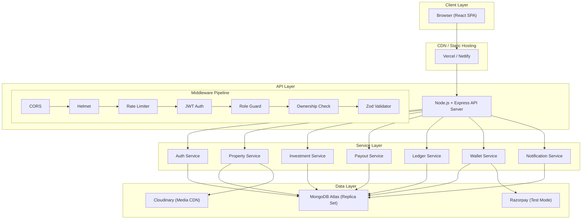

---

## 2. Repository & Folder Structure

```
fractional-estate/
├── client/                          # React (Vite) Frontend
│   ├── public/
│   │   └── favicon.ico
│   ├── src/
│   │   ├── api/                     # Axios instance + endpoint functions
│   │   │   ├── axios.js             # Base config, interceptors, token refresh
│   │   │   ├── auth.api.js          # register, login, logout, me, forgotPassword
│   │   │   ├── properties.api.js    # CRUD, marketplace, status transitions
│   │   │   ├── investments.api.js   # invest, getMyInvestments
│   │   │   ├── wallet.api.js        # balance, topup, withdraw, transactions
│   │   │   ├── portfolio.api.js     # summary, holdings
│   │   │   ├── admin.api.js         # stats, users, kyc, withdrawals, settings
│   │   │   ├── enquiries.api.js     # create, list, reply
│   │   │   └── notifications.api.js # list, markRead
│   │   │
│   │   ├── components/              # Reusable UI components
│   │   │   ├── ui/                  # Design system primitives (shadcn/ui)
│   │   │   │   ├── Button.jsx
│   │   │   │   ├── Card.jsx
│   │   │   │   ├── StatusChip.jsx
│   │   │   │   ├── Modal.jsx
│   │   │   │   ├── Input.jsx
│   │   │   │   ├── Table.jsx
│   │   │   │   ├── Pagination.jsx
│   │   │   │   ├── Spinner.jsx
│   │   │   │   ├── EmptyState.jsx
│   │   │   │   ├── Toast.jsx
│   │   │   │   └── KPICard.jsx
│   │   │   ├── charts/              # Chart components
│   │   │   │   ├── AllocationDonut.jsx
│   │   │   │   ├── FundingProgressBar.jsx
│   │   │   │   ├── FundsRaisedLine.jsx
│   │   │   │   └── PropertiesByStatus.jsx
│   │   │   ├── property/            # Property-specific components
│   │   │   │   ├── PropertyCard.jsx
│   │   │   │   ├── PropertyGallery.jsx
│   │   │   │   ├── ReturnCalculator.jsx
│   │   │   │   ├── MetricsCard.jsx
│   │   │   │   ├── InvestorTable.jsx
│   │   │   │   └── FilterSidebar.jsx
│   │   │   └── layout/              # Layout components
│   │   │       ├── Sidebar.jsx       # Role-aware sidebar
│   │   │       ├── TopBar.jsx        # Wallet balance, notifications, avatar
│   │   │       └── Footer.jsx        # Disclaimer
│   │   │
│   │   ├── layouts/                 # Page layouts
│   │   │   ├── PublicLayout.jsx     # Landing, marketplace, auth
│   │   │   └── DashboardLayout.jsx  # Role-aware: sidebar + topbar + content
│   │   │
│   │   ├── pages/                   # Route-level page components
│   │   │   ├── public/
│   │   │   │   ├── Landing.jsx
│   │   │   │   ├── Marketplace.jsx
│   │   │   │   ├── PropertyDetail.jsx
│   │   │   │   ├── Login.jsx
│   │   │   │   ├── Signup.jsx
│   │   │   │   ├── ForgotPassword.jsx
│   │   │   │   └── ResetPassword.jsx
│   │   │   ├── investor/
│   │   │   │   ├── Dashboard.jsx
│   │   │   │   ├── Portfolio.jsx
│   │   │   │   ├── InvestCheckout.jsx
│   │   │   │   ├── Wallet.jsx
│   │   │   │   ├── KYC.jsx
│   │   │   │   └── Enquiries.jsx
│   │   │   ├── broker/
│   │   │   │   ├── Dashboard.jsx
│   │   │   │   ├── MyProperties.jsx
│   │   │   │   ├── CreateProperty.jsx  # Multi-step form
│   │   │   │   └── PropertyAnalytics.jsx
│   │   │   ├── admin/
│   │   │   │   ├── Dashboard.jsx
│   │   │   │   ├── AllProperties.jsx
│   │   │   │   ├── RecordSale.jsx
│   │   │   │   ├── Users.jsx
│   │   │   │   ├── KYCQueue.jsx
│   │   │   │   ├── Withdrawals.jsx
│   │   │   │   └── Settings.jsx
│   │   │   ├── shared/
│   │   │   │   ├── Profile.jsx
│   │   │   │   ├── Notifications.jsx
│   │   │   │   ├── NotFound404.jsx
│   │   │   │   └── Forbidden403.jsx
│   │   │
│   │   ├── hooks/                   # Custom React hooks
│   │   │   ├── useAuth.js
│   │   │   ├── useProperties.js
│   │   │   ├── usePortfolio.js
│   │   │   ├── useWallet.js
│   │   │   └── useNotifications.js
│   │   │
│   │   ├── context/                 # React Context providers
│   │   │   └── AuthContext.jsx      # User state, login/logout, token management
│   │   │
│   │   ├── routes/                  # Routing configuration
│   │   │   ├── AppRouter.jsx        # Main router setup
│   │   │   ├── ProtectedRoute.jsx   # Auth guard
│   │   │   └── RoleRoute.jsx        # Role-based route guard
│   │   │
│   │   ├── utils/                   # Utility functions
│   │   │   ├── formatINR.js         # Intl.NumberFormat('en-IN', ...)
│   │   │   ├── calc.js              # projectedValue, ROI, ownershipPct
│   │   │   └── constants.js         # Status enums, role enums, colours
│   │   │
│   │   ├── App.jsx
│   │   ├── main.jsx
│   │   └── index.css                # Tailwind + design tokens
│   │
│   ├── .env.example
│   ├── tailwind.config.js
│   ├── vite.config.js
│   └── package.json
│
├── server/                          # Node.js + Express Backend
│   ├── src/
│   │   ├── config/                  # Configuration
│   │   │   ├── db.js                # MongoDB connection (mongoose)
│   │   │   ├── cloudinary.js        # Cloudinary SDK setup
│   │   │   ├── razorpay.js          # Razorpay instance
│   │   │   └── env.js               # Validated env vars (dotenv + zod)
│   │   │
│   │   ├── models/                  # Mongoose schemas
│   │   │   ├── User.js
│   │   │   ├── Property.js
│   │   │   ├── Investment.js
│   │   │   ├── Transaction.js       # Ledger (append-only)
│   │   │   ├── Payout.js
│   │   │   ├── Withdrawal.js
│   │   │   ├── Enquiry.js
│   │   │   ├── Notification.js
│   │   │   └── Settings.js          # Singleton config document
│   │   │
│   │   ├── routes/                  # Express route definitions
│   │   │   ├── auth.routes.js
│   │   │   ├── property.routes.js
│   │   │   ├── investment.routes.js
│   │   │   ├── wallet.routes.js
│   │   │   ├── portfolio.routes.js
│   │   │   ├── admin.routes.js
│   │   │   ├── kyc.routes.js
│   │   │   ├── enquiry.routes.js
│   │   │   └── notification.routes.js
│   │   │
│   │   ├── controllers/             # Request/response handling
│   │   │   ├── auth.controller.js
│   │   │   ├── property.controller.js
│   │   │   ├── investment.controller.js
│   │   │   ├── wallet.controller.js
│   │   │   ├── portfolio.controller.js
│   │   │   ├── admin.controller.js
│   │   │   ├── kyc.controller.js
│   │   │   ├── enquiry.controller.js
│   │   │   └── notification.controller.js
│   │   │
│   │   ├── services/                # Business logic (NO req/res)
│   │   │   ├── auth.service.js      # register, login, verify, resetPassword
│   │   │   ├── property.service.js  # create, update, submit, approve, reject, cancel
│   │   │   ├── investment.service.js # invest() — atomic with transactions
│   │   │   ├── payout.service.js    # previewPayout(), executePayout() — idempotent
│   │   │   ├── ledger.service.js    # post() — single entry point for all money moves
│   │   │   ├── wallet.service.js    # getBalance(), topup(), withdraw()
│   │   │   └── notification.service.js # create, list, markRead
│   │   │
│   │   ├── middlewares/             # Express middleware
│   │   │   ├── authenticate.js      # JWT verification + isActive check
│   │   │   ├── requireRole.js       # Role-based access (ADMIN, BROKER, INVESTOR)
│   │   │   ├── requireOwnership.js  # Broker can only access own properties
│   │   │   ├── validate.js          # Zod schema validation wrapper
│   │   │   ├── errorHandler.js      # Central error handler
│   │   │   ├── rateLimiter.js       # express-rate-limit config
│   │   │   └── upload.js            # Multer config for file uploads
│   │   │
│   │   ├── validators/              # Zod schemas for request validation
│   │   │   ├── auth.validator.js
│   │   │   ├── property.validator.js
│   │   │   ├── investment.validator.js
│   │   │   ├── wallet.validator.js
│   │   │   └── admin.validator.js
│   │   │
│   │   ├── utils/                   # Shared utilities
│   │   │   ├── ApiError.js          # Custom error class with statusCode + code
│   │   │   ├── money.js             # paise conversion, rounding helpers
│   │   │   ├── asyncHandler.js      # Wraps async route handlers
│   │   │   └── pagination.js        # Pagination helper
│   │   │
│   │   └── app.js                   # Express app setup + middleware registration
│   │
│   ├── scripts/
│   │   └── seed.js                  # Seed script with realistic demo data
│   │
│   ├── server.js                    # Entry point: connect DB, start listening
│   ├── .env.example
│   └── package.json
│
├── PROMPTS.md                       # Key prompts log
├── README.md                        # Setup guide + test credentials
├── SPEC.md                          # Paste of data models, API, pages for AI context
└── .gitignore
```

---

## 3. Backend Architecture

### 3.1 Request Processing Pipeline

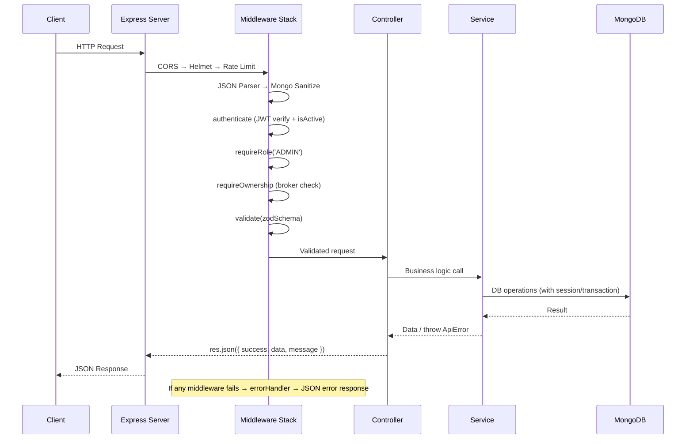

### 3.2 Layered Architecture

```
┌──────────────────────────────────────────────┐
│                  Routes Layer                 │
│  Defines HTTP method + path + middleware      │
│  chain for each endpoint                      │
├──────────────────────────────────────────────┤
│               Controllers Layer               │
│  Extracts params/body from req                │
│  Calls service, formats response              │
│  NEVER contains business logic                │
├──────────────────────────────────────────────┤
│                Services Layer                 │
│  ALL business logic lives here                │
│  Manages MongoDB sessions/transactions        │
│  Throws ApiError for error cases              │
│  NO access to req/res objects                 │
├──────────────────────────────────────────────┤
│                 Models Layer                  │
│  Mongoose schemas + indexes + virtuals        │
│  Validation at the schema level               │
│  Static/instance methods                      │
├──────────────────────────────────────────────┤
│                  Database                     │
│  MongoDB Atlas (Replica Set)                  │
│  Multi-document transactions supported        │
└──────────────────────────────────────────────┘
```

### 3.3 Middleware Stack Detail

```js
// app.js — middleware registration order
app.use(cors({ origin: process.env.CLIENT_URL, credentials: true }));
app.use(helmet());
app.use(express.json({ limit: '10mb' }));
app.use(mongoSanitize());
app.use(morgan('dev'));

// Route-level middlewares (applied per route):
// authenticate     → verifies JWT, attaches req.user, checks isActive
// requireRole(...) → checks req.user.role against allowed roles
// requireOwnership → for broker routes, checks req.user._id === property.brokerId
// validate(schema) → runs Zod .parse() on req.body / req.query / req.params
// rateLimit        → express-rate-limit on /auth/* and /investments

// After all routes:
app.use(errorHandler);  // Central error handler
```

### 3.4 Error Handling Strategy

```js
// utils/ApiError.js
class ApiError extends Error {
  constructor(statusCode, code, message, details = []) {
    super(message);
    this.statusCode = statusCode;
    this.code = code;
    this.details = details;
  }
}

// middlewares/errorHandler.js
function errorHandler(err, req, res, next) {
  const statusCode = err.statusCode || 500;
  res.status(statusCode).json({
    success: false,
    error: {
      code: err.code || 'INTERNAL_ERROR',
      message: err.message || 'Something went wrong',
      details: err.details || []
    }
  });
}
```

---

## 4. Database Architecture

### 4.1 MongoDB Schema Design

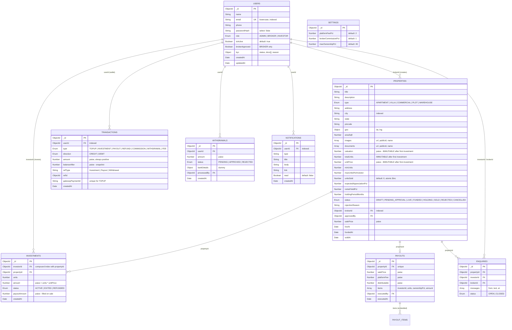

### 4.2 Key Indexes

```js
// users
{ email: 1 }                           // unique

// properties
{ status: 1, city: 1 }                 // marketplace queries
{ brokerId: 1 }                        // broker's properties

// investments
{ investorId: 1, propertyId: 1 }       // compound — portfolio + per-property lookup
{ propertyId: 1 }                       // property's investors

// transactions
{ userId: 1, createdAt: -1 }           // wallet history
{ gatewayPaymentId: 1 }                // unique sparse — prevent double topup

// payouts
{ propertyId: 1 }                       // unique — idempotency check

// notifications
{ userId: 1, read: 1, createdAt: -1 }  // unread first, newest first
```

---

## 5. Frontend Architecture

### 5.1 Component Hierarchy

```mermaid
graph TD
    App["App.jsx"]
    App --> AppRouter

    AppRouter --> PublicLayout
    AppRouter --> DashboardLayout

    PublicLayout --> Landing
    PublicLayout --> Marketplace
    PublicLayout --> PropertyDetail
    PublicLayout --> Login
    PublicLayout --> Signup

    DashboardLayout --> Sidebar["Sidebar (role-aware)"]
    DashboardLayout --> TopBar["TopBar (wallet, notifs)"]
    DashboardLayout --> InvDash["Investor Dashboard"]
    DashboardLayout --> InvPortfolio["Investor Portfolio"]
    DashboardLayout --> InvWallet["Investor Wallet"]
    DashboardLayout --> InvCheckout["Invest Checkout"]
    DashboardLayout --> BrkDash["Broker Dashboard"]
    DashboardLayout --> BrkProps["Broker Properties"]
    DashboardLayout --> BrkCreate["Create Property (multi-step)"]
    DashboardLayout --> AdmDash["Admin Dashboard"]
    DashboardLayout --> AdmProps["Admin Properties"]
    DashboardLayout --> AdmSell["Record Sale"]
    DashboardLayout --> AdmUsers["User Management"]
```

### 5.2 Routing Strategy

```jsx
// routes/AppRouter.jsx
<BrowserRouter>
  <Routes>
    {/* Public routes */}
    <Route element={<PublicLayout />}>
      <Route path="/" element={<Landing />} />
      <Route path="/properties" element={<Marketplace />} />
      <Route path="/properties/:id" element={<PropertyDetail />} />
      <Route path="/login" element={<Login />} />
      <Route path="/signup" element={<Signup />} />
    </Route>

    {/* Investor routes */}
    <Route element={<ProtectedRoute />}>
      <Route element={<RoleRoute role="INVESTOR" />}>
        <Route element={<DashboardLayout />}>
          <Route path="/investor" element={<Dashboard />} />
          <Route path="/investor/portfolio" element={<Portfolio />} />
          <Route path="/investor/invest/:id" element={<InvestCheckout />} />
          <Route path="/investor/wallet" element={<Wallet />} />
          <Route path="/investor/kyc" element={<KYC />} />
          <Route path="/investor/enquiries" element={<Enquiries />} />
        </Route>
      </Route>
    </Route>

    {/* Broker routes */}
    <Route element={<ProtectedRoute />}>
      <Route element={<RoleRoute role="BROKER" />}>
        <Route element={<DashboardLayout />}>
          <Route path="/broker" element={<Dashboard />} />
          <Route path="/broker/properties" element={<MyProperties />} />
          <Route path="/broker/properties/new" element={<CreateProperty />} />
          <Route path="/broker/properties/:id" element={<PropertyAnalytics />} />
        </Route>
      </Route>
    </Route>

    {/* Admin routes */}
    <Route element={<ProtectedRoute />}>
      <Route element={<RoleRoute role="ADMIN" />}>
        <Route element={<DashboardLayout />}>
          <Route path="/admin" element={<Dashboard />} />
          <Route path="/admin/properties" element={<AllProperties />} />
          <Route path="/admin/properties/:id/sell" element={<RecordSale />} />
          <Route path="/admin/users" element={<Users />} />
          <Route path="/admin/kyc" element={<KYCQueue />} />
          <Route path="/admin/withdrawals" element={<Withdrawals />} />
          <Route path="/admin/settings" element={<Settings />} />
        </Route>
      </Route>
    </Route>

    {/* Error pages */}
    <Route path="/forbidden" element={<Forbidden403 />} />
    <Route path="*" element={<NotFound404 />} />
  </Routes>
</BrowserRouter>
```

### 5.3 State Management

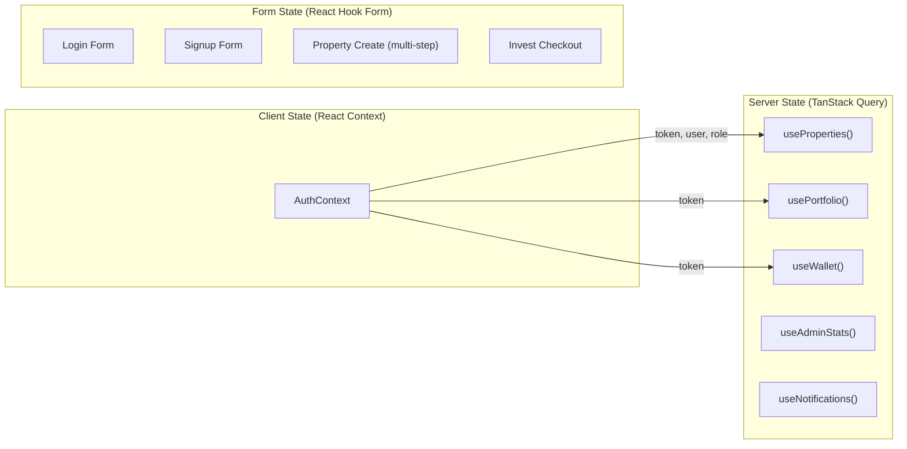

**Strategy:**
- **TanStack Query** for all server state (caching, refetching, optimistic updates)
- **React Context** for auth state only (user, token, role)
- **React Hook Form + Zod** for all forms (client-side validation mirroring server schemas)
- No Redux needed — TanStack Query handles all data fetching complexity

### 5.4 API Client Architecture

```js
// api/axios.js
const api = axios.create({
  baseURL: import.meta.env.VITE_API_URL + '/api/v1',
  headers: { 'Content-Type': 'application/json' }
});

// Request interceptor — attach token
api.interceptors.request.use(config => {
  const token = localStorage.getItem('token');
  if (token) config.headers.Authorization = `Bearer ${token}`;
  return config;
});

// Response interceptor — handle errors globally
api.interceptors.response.use(
  response => response.data,
  error => {
    if (error.response?.status === 401) {
      // Clear auth, redirect to login
    }
    return Promise.reject(error.response?.data || error);
  }
);
```

---

## 6. Authentication Architecture

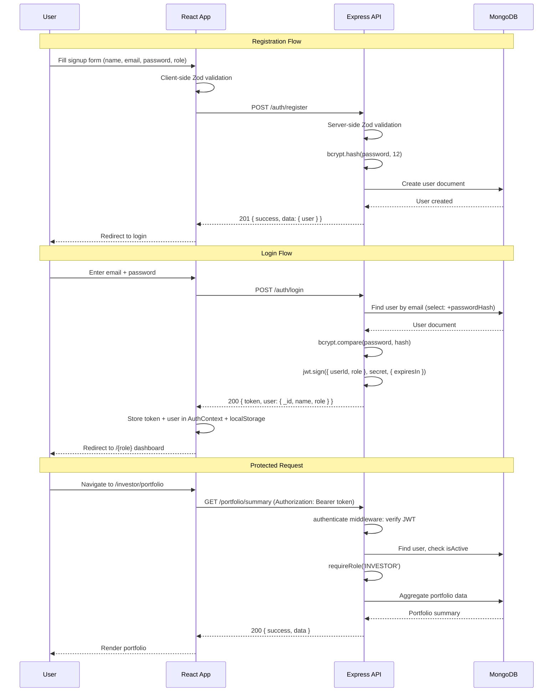

### Auth Middleware Chain

```
authenticate(req, res, next)
├── Extract token from Authorization header
├── jwt.verify(token, JWT_SECRET)
├── Find user by decoded.userId
├── Check user.isActive === true (else 401)
├── Attach req.user = user
└── next()

requireRole(...roles)(req, res, next)
├── Check req.user.role is in allowed roles
├── If BROKER, also check brokerApproved === true
└── 403 FORBIDDEN if not authorised

requireOwnership(req, res, next)  [for broker routes]
├── Find property by req.params.id
├── Check property.brokerId === req.user._id
└── 403 if not owner
```

---

## 7. Investment Engine Architecture

This is the most critical service — it handles real money atomically.

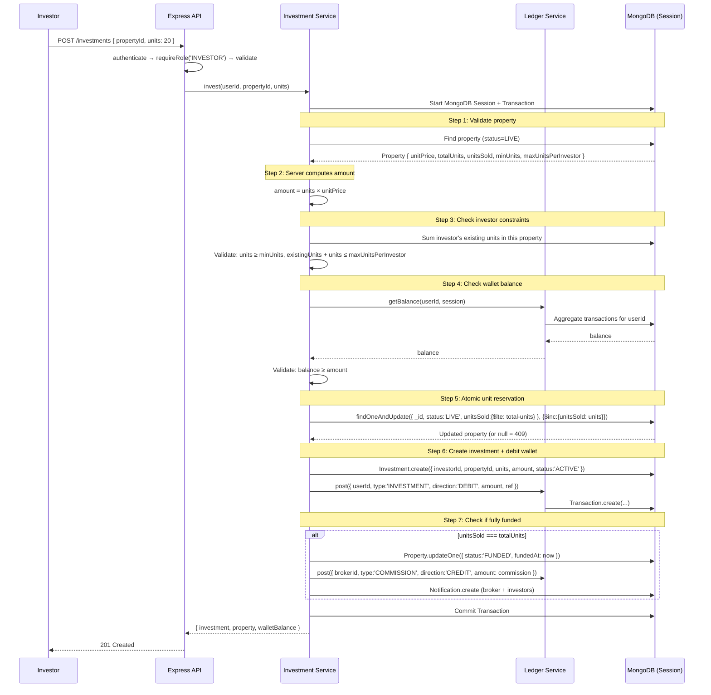

### Concurrency Control — The Atomic Guard

```js
// The single most important query in the system
const updatedProperty = await Property.findOneAndUpdate(
  {
    _id: propertyId,
    status: 'LIVE',
    unitsSold: { $lte: totalUnits - requestedUnits }  // ← atomic guard
  },
  {
    $inc: { unitsSold: requestedUnits }
  },
  { new: true, session }
);

if (!updatedProperty) {
  throw new ApiError(409, 'INSUFFICIENT_UNITS', `Only ${remaining} units remain`);
}
```

**Why this works:**
- MongoDB's `findOneAndUpdate` is atomic at the document level
- The filter `unitsSold: { $lte: totalUnits - units }` ensures the update only happens if enough units remain
- If two requests race, the first one increments `unitsSold` and the second finds the filter no longer matches → returns `null` → 409

---

## 8. Payout Engine Architecture

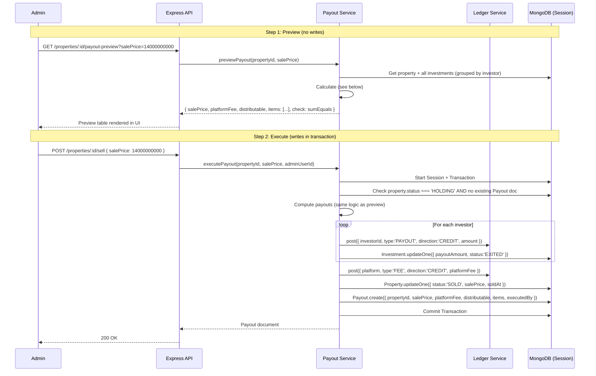

### Payout Calculation (Integer Math)

```js
function computePayouts(salePrice, platformFeePct, investments, totalUnits) {
  // All values in paise (integers)
  const platformFee = Math.floor(salePrice * platformFeePct / 100);
  const distributable = salePrice - platformFee;

  // Group investments by investor, sum their units
  const holders = groupByInvestor(investments); // [{ investorId, totalUnits }]

  // Calculate each payout with floor
  let payoutSum = 0;
  let largestHolder = null;
  let largestUnits = 0;

  const items = holders.map(h => {
    const payout = Math.floor(distributable * h.totalUnits / totalUnits);
    payoutSum += payout;
    if (h.totalUnits > largestUnits) {
      largestUnits = h.totalUnits;
      largestHolder = h.investorId;
    }
    return { investorId: h.investorId, units: h.totalUnits, amount: payout };
  });

  // Assign remainder to largest holder
  const remainder = distributable - payoutSum;
  if (remainder > 0) {
    const largest = items.find(i => i.investorId === largestHolder);
    largest.amount += remainder;
  }

  // ASSERTION: sum must equal distributable exactly
  const finalSum = items.reduce((s, i) => s + i.amount, 0);
  assert(finalSum === distributable, 'Payout sum mismatch!');

  return { salePrice, platformFee, distributable, items };
}
```

---

## 9. Wallet & Ledger Architecture

### The Ledger is the Source of Truth

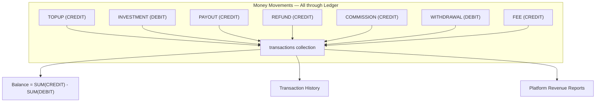

### Core Ledger Service

```js
// services/ledger.service.js
async function post({ userId, type, direction, amount, refType, refId, gatewayPaymentId, session }) {
  // 1. For TOPUP: check gatewayPaymentId uniqueness
  if (type === 'TOPUP' && gatewayPaymentId) {
    const exists = await Transaction.findOne({ gatewayPaymentId }).session(session);
    if (exists) throw new ApiError(409, 'DUPLICATE_TOPUP', 'Payment already processed');
  }

  // 2. Compute new balance
  const currentBalance = await getBalance(userId, session);
  const balanceAfter = direction === 'CREDIT'
    ? currentBalance + amount
    : currentBalance - amount;

  if (balanceAfter < 0) {
    throw new ApiError(400, 'INSUFFICIENT_BALANCE', 'Not enough funds');
  }

  // 3. Create append-only ledger entry
  const txn = await Transaction.create([{
    userId, type, direction, amount, balanceAfter,
    refType, refId, gatewayPaymentId
  }], { session });

  return txn[0];
}

async function getBalance(userId, session) {
  const result = await Transaction.aggregate([
    { $match: { userId } },
    { $group: {
      _id: null,
      credits: { $sum: { $cond: [{ $eq: ['$direction', 'CREDIT'] }, '$amount', 0] } },
      debits:  { $sum: { $cond: [{ $eq: ['$direction', 'DEBIT']  }, '$amount', 0] } }
    }}
  ]).session(session);

  return result.length ? result[0].credits - result[0].debits : 0;
}
```

---

## 10. Property State Machine Implementation

```js
// services/property.service.js

const VALID_TRANSITIONS = {
  'DRAFT':              ['PENDING_APPROVAL'],
  'PENDING_APPROVAL':   ['LIVE', 'REJECTED'],
  'REJECTED':           ['PENDING_APPROVAL'],
  'LIVE':               ['FUNDED', 'CANCELLED'],  // FUNDED is system-only
  'FUNDED':             ['HOLDING'],
  'HOLDING':            ['SOLD'],
  'SOLD':               [],
  'CANCELLED':          []
};

function validateTransition(currentStatus, newStatus) {
  const allowed = VALID_TRANSITIONS[currentStatus] || [];
  if (!allowed.includes(newStatus)) {
    throw new ApiError(409, 'INVALID_TRANSITION',
      `Cannot move from ${currentStatus} to ${newStatus}`);
  }
}

// Before LIVE → CANCELLED: refund all investors
async function cancelProperty(propertyId, adminId, session) {
  const property = await Property.findById(propertyId).session(session);
  validateTransition(property.status, 'CANCELLED');

  // Get all investments
  const investments = await Investment.find({
    propertyId, status: 'ACTIVE'
  }).session(session);

  // Refund each investor
  for (const inv of investments) {
    await ledgerService.post({
      userId: inv.investorId,
      type: 'REFUND', direction: 'CREDIT',
      amount: inv.amount,
      refType: 'Investment', refId: inv._id,
      session
    });
    inv.status = 'REFUNDED';
    await inv.save({ session });
  }

  property.status = 'CANCELLED';
  property.unitsSold = 0;
  await property.save({ session });
}
```

---

## 11. Deployment Architecture

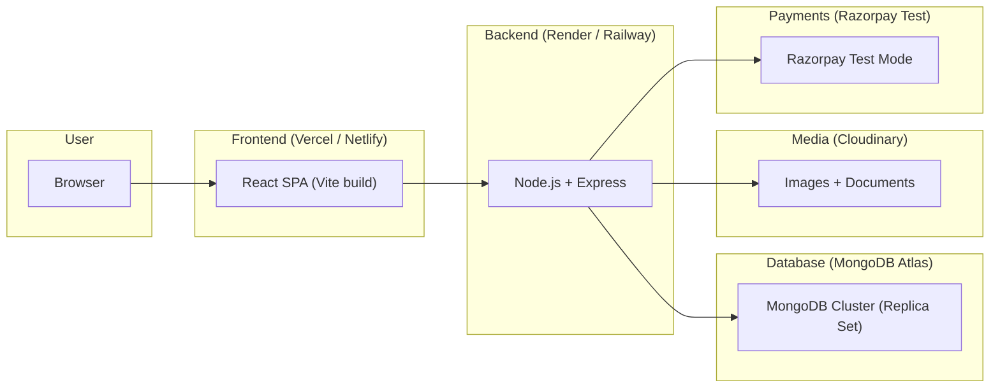

### Environment Variables

**Server `.env.example`:**
```dotenv
# Server
PORT=5000
NODE_ENV=development

# Database
MONGO_URI=mongodb+srv://<user>:<pass>@cluster.mongodb.net/fractional

# Auth
JWT_SECRET=change_me_to_a_long_random_string
JWT_EXPIRES_IN=1d

# Frontend
CLIENT_URL=http://localhost:5173

# Cloudinary
CLOUDINARY_CLOUD_NAME=
CLOUDINARY_API_KEY=
CLOUDINARY_API_SECRET=

# Razorpay (test mode)
RAZORPAY_KEY_ID=rzp_test_xxx
RAZORPAY_KEY_SECRET=

# Platform config defaults
PLATFORM_FEE_PCT=2
BROKER_COMMISSION_PCT=1
MAX_OWNERSHIP_PCT=49
```

**Client `.env.example`:**
```dotenv
VITE_API_URL=http://localhost:5000
VITE_RAZORPAY_KEY_ID=rzp_test_xxx
```

---

## 12. Development Workflow & Milestones

### Phase Breakdown

```mermaid
gantt
    title Development Phases
    dateFormat  X
    axisFormat  %s%%

    section Phase 0 - Plan
    Repo setup, SPEC.md, role assignment   :done, p0, 0, 5

    section Phase 1 - Foundation
    MongoDB models + seed script           :active, p1a, 5, 10
    Auth (register/login/JWT/middleware)    :p1b, 5, 12
    Express app skeleton + error handling  :p1c, 5, 10
    React app + routing + layouts          :p1d, 8, 15
    Deploy skeleton                        :p1e, 13, 20

    section Phase 2 - Core Flow
    Property CRUD + status machine         :p2a, 20, 35
    Marketplace + property detail UI       :p2b, 20, 35
    Invest flow (atomic engine)            :p2c, 30, 45
    Broker create listing (multi-step)     :p2d, 25, 40
    Admin approve/reject flow              :p2e, 30, 42

    section Phase 3 - Money
    Wallet + topup (mock or Razorpay test) :p3a, 45, 55
    Ledger service                         :p3b, 45, 55
    Payout engine (preview + execute)      :p3c, 50, 65
    Portfolio with ROI calculations         :p3d, 55, 65

    section Phase 4 - Polish
    Dashboards (admin, broker, investor)    :p4a, 65, 80
    Charts (donut, line, progress)          :p4b, 70, 80
    KYC, enquiries, notifications (P1)      :p4c, 72, 82
    Loading/empty/error states              :p4d, 75, 85
    Responsive design pass                  :p4e, 80, 90

    section Phase 5 - Ship
    Final deployment                        :p5a, 90, 93
    Seed data verification                  :p5b, 90, 93
    README + .env.example                   :p5c, 93, 96
    Demo video recording                    :p5d, 93, 97
    PROMPTS.md + Postman                    :p5e, 95, 100
```

### Implementation Sequence (Recommended Order)

| Step | What to Build | Why This Order |
|------|--------------|----------------|
| 1 | Mongoose models + seed script | Everything depends on the data layer |
| 2 | Auth (register, login, JWT, middleware) | All other features need auth |
| 3 | Express skeleton (routes, error handler, CORS, helmet) | API structure for all features |
| 4 | React app (Vite, routing, layouts, auth context) | UI structure for all features |
| 5 | Property CRUD + status machine | Core entity of the platform |
| 6 | Marketplace + Property detail page | Public-facing value — shows progress |
| 7 | Wallet + Ledger service | Investment requires wallet to work |
| 8 | Investment engine (atomic) | The most critical business logic |
| 9 | Payout engine (preview + execute) | Completes the lifecycle |
| 10 | Admin dashboard + approval flows | Operator experience |
| 11 | Broker dashboard + create listing wizard | Broker experience |
| 12 | Investor dashboard + portfolio | Investor experience |
| 13 | Charts, KPIs, polish | Visual refinement |
| 14 | P1 features (KYC, enquiries, notifications, withdrawal) | Higher marks |
| 15 | Seed data, README, deploy, demo video | Ship it |

---

## 13. Tech Stack Summary

| Layer       | Technology                    | Purpose                                              |
|-------------|-------------------------------|------------------------------------------------------|
| Frontend    | React 18 (Vite)               | SPA framework                                        |
| Routing     | React Router v6               | Client-side routing with nested layouts              |
| Styling     | Tailwind CSS + shadcn/ui      | Utility-first CSS + accessible component library     |
| Forms       | React Hook Form + Zod         | Form state + client-side validation                  |
| Data fetch  | TanStack Query v5             | Server state management, caching, refetching         |
| Charts      | Recharts                      | Donut, line, bar charts                              |
| Animation   | Framer Motion                 | Page transitions, micro-animations                   |
| Toasts      | react-hot-toast               | Success/error notifications                          |
| Gallery     | Swiper                        | Image gallery carousel                               |
| Backend     | Node.js + Express             | REST API server                                      |
| ODM         | Mongoose                      | MongoDB object modelling + validation                |
| Auth        | jsonwebtoken + bcrypt          | JWT generation + password hashing                    |
| Validation  | Zod                           | Server-side request validation                       |
| Upload      | Multer + Cloudinary SDK       | File upload handling + cloud storage                 |
| Security    | helmet + cors + express-rate-limit + express-mongo-sanitize | Security hardening |
| Logging     | morgan                        | HTTP request logging                                 |
| Email (P1)  | Nodemailer / Resend           | Password reset emails                                |
| Database    | MongoDB Atlas                 | Document database with replica set for transactions  |
| Payments    | Razorpay (test mode)          | Wallet top-up (or labelled mock)                     |
| Deploy FE   | Vercel / Netlify              | Static SPA hosting                                   |
| Deploy BE   | Render / Railway              | Node.js server hosting                               |
