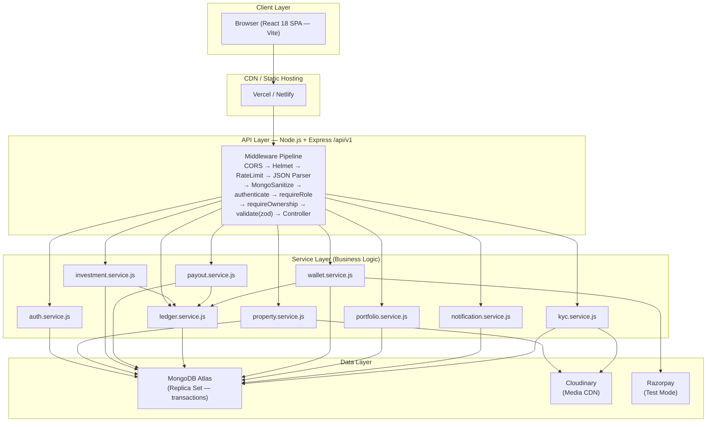
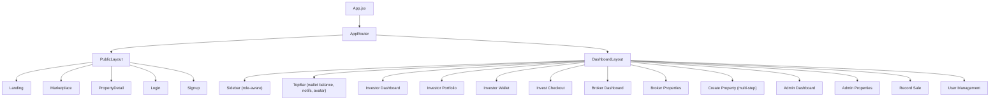

# Design Document

**Product:** ESTORA — Fractional Real Estate Investment Portal
**Feature:** estora-platform
**Version:** 1.0
**Date:** 2026-10-02
**Workflow:** Requirements-First

---

## Overview

ESTORA is a MERN-stack fractional real-estate investment portal. A React 18 single-page application (served via Vercel/Netlify) communicates exclusively through a versioned REST API (`/api/v1`) served by a Node.js + Express server (hosted on Render/Railway). The Express server processes every request through a deterministic middleware pipeline — CORS, Helmet, rate limiting, JWT authentication, role enforcement, ownership checks, and Zod validation — before delegating to a pure service layer that contains all business logic. All financial state lives in MongoDB Atlas (replica set), which enables the multi-document ACID transactions required by the investment engine, the payout engine, and the cancellation refund flow. An append-only `transactions` ledger is the single source of truth for every money movement; the `walletBalance` integer on the User document is kept in sync atomically inside the same transaction. External integrations — Cloudinary for media, Razorpay test mode for payments — are isolated behind service wrappers. The full property lifecycle (DRAFT → PENDING_APPROVAL → LIVE → FUNDED → HOLDING → SOLD, plus REJECTED and CANCELLED branches) is enforced server-side by a validated state machine so no UI bypass can produce an illegal transition. This design satisfies requirements R1–R44 and correctness properties CP1–CP6.

---

## Architecture



### Layer Descriptions

| Layer | Responsibility |
|---|---|
| **Client** | React SPA — routing, form state, server-state caching (TanStack Query), auth context |
| **CDN / Static Hosting** | Serves the Vite build artifact; no server-side rendering |
| **API Layer** | Express app — routes, middleware chain, controllers (extract params, format response) |
| **Service Layer** | All business logic; no access to `req`/`res`; throws `ApiError` for failures |
| **Data Layer** | MongoDB Atlas (documents + ACID transactions), Cloudinary (media), Razorpay (payment gateway) |

---

## Folder Structure

```
fractional-estate/
├── client/                          # React (Vite) Frontend
│   ├── public/
│   │   └── favicon.ico
│   ├── src/
│   │   ├── api/                     # Axios instance + endpoint functions
│   │   │   ├── axios.js             # Base config, interceptors, token refresh
│   │   │   ├── auth.api.js          # register, login, logout, me, forgotPassword
│   │   │   ├── properties.api.js    # CRUD, marketplace, status transitions
│   │   │   ├── investments.api.js   # invest, getMyInvestments
│   │   │   ├── wallet.api.js        # balance, topup, withdraw, transactions
│   │   │   ├── portfolio.api.js     # summary, holdings
│   │   │   ├── admin.api.js         # stats, users, kyc, withdrawals, settings
│   │   │   ├── enquiries.api.js     # create, list, reply
│   │   │   └── notifications.api.js # list, markRead
│   │   │
│   │   ├── components/              # Reusable UI components
│   │   │   ├── ui/                  # Design system primitives (shadcn/ui)
│   │   │   │   ├── Button.jsx
│   │   │   │   ├── Card.jsx
│   │   │   │   ├── StatusChip.jsx
│   │   │   │   ├── Modal.jsx
│   │   │   │   ├── Input.jsx
│   │   │   │   ├── Table.jsx
│   │   │   │   ├── Pagination.jsx
│   │   │   │   ├── Spinner.jsx
│   │   │   │   ├── EmptyState.jsx
│   │   │   │   ├── Toast.jsx
│   │   │   │   └── KPICard.jsx
│   │   │   ├── charts/              # Chart components
│   │   │   │   ├── AllocationDonut.jsx
│   │   │   │   ├── FundingProgressBar.jsx
│   │   │   │   ├── FundsRaisedLine.jsx
│   │   │   │   └── PropertiesByStatus.jsx
│   │   │   ├── property/            # Property-specific components
│   │   │   │   ├── PropertyCard.jsx
│   │   │   │   ├── PropertyGallery.jsx
│   │   │   │   ├── ReturnCalculator.jsx
│   │   │   │   ├── MetricsCard.jsx
│   │   │   │   ├── InvestorTable.jsx
│   │   │   │   └── FilterSidebar.jsx
│   │   │   └── layout/              # Layout components
│   │   │       ├── Sidebar.jsx       # Role-aware sidebar
│   │   │       ├── TopBar.jsx        # Wallet balance, notifications, avatar
│   │   │       └── Footer.jsx        # Disclaimer
│   │   │
│   │   ├── layouts/                 # Page layouts
│   │   │   ├── PublicLayout.jsx     # Landing, marketplace, auth
│   │   │   └── DashboardLayout.jsx  # Role-aware: sidebar + topbar + content
│   │   │
│   │   ├── pages/                   # Route-level page components
│   │   │   ├── public/
│   │   │   │   ├── Landing.jsx
│   │   │   │   ├── Marketplace.jsx
│   │   │   │   ├── PropertyDetail.jsx
│   │   │   │   ├── Login.jsx
│   │   │   │   ├── Signup.jsx
│   │   │   │   ├── ForgotPassword.jsx
│   │   │   │   └── ResetPassword.jsx
│   │   │   ├── investor/
│   │   │   │   ├── Dashboard.jsx
│   │   │   │   ├── Portfolio.jsx
│   │   │   │   ├── InvestCheckout.jsx
│   │   │   │   ├── Wallet.jsx
│   │   │   │   ├── KYC.jsx
│   │   │   │   └── Enquiries.jsx
│   │   │   ├── broker/
│   │   │   │   ├── Dashboard.jsx
│   │   │   │   ├── MyProperties.jsx
│   │   │   │   ├── CreateProperty.jsx  # Multi-step form
│   │   │   │   └── PropertyAnalytics.jsx
│   │   │   ├── admin/
│   │   │   │   ├── Dashboard.jsx
│   │   │   │   ├── AllProperties.jsx
│   │   │   │   ├── RecordSale.jsx
│   │   │   │   ├── Users.jsx
│   │   │   │   ├── KYCQueue.jsx
│   │   │   │   ├── Withdrawals.jsx
│   │   │   │   └── Settings.jsx
│   │   │   ├── shared/
│   │   │   │   ├── Profile.jsx
│   │   │   │   ├── Notifications.jsx
│   │   │   │   ├── NotFound404.jsx
│   │   │   │   └── Forbidden403.jsx
│   │   │
│   │   ├── hooks/                   # Custom React hooks
│   │   │   ├── useAuth.js
│   │   │   ├── useProperties.js
│   │   │   ├── usePortfolio.js
│   │   │   ├── useWallet.js
│   │   │   └── useNotifications.js
│   │   │
│   │   ├── context/                 # React Context providers
│   │   │   └── AuthContext.jsx      # User state, login/logout, token management
│   │   │
│   │   ├── routes/                  # Routing configuration
│   │   │   ├── AppRouter.jsx        # Main router setup
│   │   │   ├── ProtectedRoute.jsx   # Auth guard
│   │   │   └── RoleRoute.jsx        # Role-based route guard
│   │   │
│   │   ├── utils/                   # Utility functions
│   │   │   ├── formatINR.js         # Intl.NumberFormat('en-IN', ...)
│   │   │   ├── calc.js              # projectedValue, ROI, ownershipPct
│   │   │   └── constants.js         # Status enums, role enums, colours
│   │   │
│   │   ├── App.jsx
│   │   ├── main.jsx
│   │   └── index.css                # Tailwind + design tokens
│   │
│   ├── .env.example
│   ├── tailwind.config.js
│   ├── vite.config.js
│   └── package.json
│
├── server/                          # Node.js + Express Backend
│   ├── src/
│   │   ├── config/                  # Configuration
│   │   │   ├── db.js                # MongoDB connection (mongoose)
│   │   │   ├── cloudinary.js        # Cloudinary SDK setup
│   │   │   ├── razorpay.js          # Razorpay instance
│   │   │   └── env.js               # Validated env vars (dotenv + zod)
│   │   │
│   │   ├── models/                  # Mongoose schemas
│   │   │   ├── User.js
│   │   │   ├── Property.js
│   │   │   ├── Investment.js
│   │   │   ├── Transaction.js       # Ledger (append-only)
│   │   │   ├── Payout.js
│   │   │   ├── Withdrawal.js
│   │   │   ├── Enquiry.js
│   │   │   ├── Notification.js
│   │   │   └── Settings.js          # Singleton config document
│   │   │
│   │   ├── routes/                  # Express route definitions
│   │   │   ├── auth.routes.js
│   │   │   ├── property.routes.js
│   │   │   ├── investment.routes.js
│   │   │   ├── wallet.routes.js
│   │   │   ├── portfolio.routes.js
│   │   │   ├── admin.routes.js
│   │   │   ├── kyc.routes.js
│   │   │   ├── enquiry.routes.js
│   │   │   └── notification.routes.js
│   │   │
│   │   ├── controllers/             # Request/response handling
│   │   │   ├── auth.controller.js
│   │   │   ├── property.controller.js
│   │   │   ├── investment.controller.js
│   │   │   ├── wallet.controller.js
│   │   │   ├── portfolio.controller.js
│   │   │   ├── admin.controller.js
│   │   │   ├── kyc.controller.js
│   │   │   ├── enquiry.controller.js
│   │   │   └── notification.controller.js
│   │   │
│   │   ├── services/                # Business logic (NO req/res)
│   │   │   ├── auth.service.js
│   │   │   ├── property.service.js
│   │   │   ├── investment.service.js
│   │   │   ├── payout.service.js
│   │   │   ├── ledger.service.js
│   │   │   ├── wallet.service.js
│   │   │   └── notification.service.js
│   │   │
│   │   ├── middlewares/             # Express middleware
│   │   │   ├── authenticate.js
│   │   │   ├── requireRole.js
│   │   │   ├── requireOwnership.js
│   │   │   ├── validate.js
│   │   │   ├── errorHandler.js
│   │   │   ├── rateLimiter.js
│   │   │   └── upload.js
│   │   │
│   │   ├── validators/              # Zod schemas
│   │   │   ├── auth.validator.js
│   │   │   ├── property.validator.js
│   │   │   ├── investment.validator.js
│   │   │   ├── wallet.validator.js
│   │   │   └── admin.validator.js
│   │   │
│   │   ├── utils/
│   │   │   ├── ApiError.js
│   │   │   ├── money.js             # paise conversion, rounding helpers
│   │   │   ├── asyncHandler.js
│   │   │   └── pagination.js
│   │   │
│   │   └── app.js                   # Express app setup + middleware registration
│   │
│   ├── scripts/
│   │   └── seed.js
│   │
│   ├── server.js
│   ├── .env.example
│   └── package.json
│
├── PROMPTS.md
├── README.md
├── SPEC.md
└── .gitignore
```

---

## Components and Interfaces

### Services

#### `auth.service.js` — R1–R6

**Purpose:** Handles user registration, authentication, and password reset.

| Method | Description |
|---|---|
| `register(data)` | Validates role (not ADMIN — R1 AC6), checks email uniqueness (R1 AC5), hashes password with bcrypt cost 10–12 (R1 AC3), creates User with `isActive=true`, `brokerApproved=false` for BROKER (R1 AC4) |
| `login(email, password)` | Finds user by email, compares bcrypt hash, checks `isActive` (R2 AC5), issues JWT `{ userId, role }` with 1-day expiry (R2 AC1) |
| `me(userId)` | Returns `{ _id, name, email, phone, role, isActive, kyc.status, brokerApproved }` (R4 AC1) |
| `forgotPassword(email)` | Generates time-limited reset token (1h), sends email via Nodemailer/Resend, always returns 200 regardless of email existence (R6 AC1, R6 AC2) |
| `resetPassword(token, newPassword)` | Validates token expiry and usage, updates `passwordHash`, invalidates token (R6 AC3, R6 AC4) |

#### `property.service.js` — R7–R15, R31, R35, R37

**Purpose:** Manages the full property lifecycle including creation, status transitions, and marketplace queries.

| Method | Description |
|---|---|
| `create(data, userId, role)` | Validates required fields, computes `unitPrice = valuation / totalUnits` (must be integer — R7 AC3), sets `brokerId`, `unitsSold=0`, `status=DRAFT` (R7) |
| `update(id, data, userId, role)` | Enforces edit rules by status: all fields in DRAFT/REJECTED; description+images only in LIVE+ (R12 AC1, R12 AC2); rejects changes to `valuation/totalUnits/unitPrice` when investments exist (R12 AC3) |
| `validateTransition(currentStatus, newStatus)` | Checks against `VALID_TRANSITIONS` map; throws `ApiError(409, 'INVALID_TRANSITION')` on illegal transitions (R8 AC1, R8 AC2) |
| `submit(id, userId)` | Transitions DRAFT/REJECTED → PENDING_APPROVAL; validates ≥ 3 images (R9) |
| `approve(id, adminId)` | Transitions PENDING_APPROVAL → LIVE; sets `approvedBy`, `liveAt` (R10, R8 AC3) |
| `reject(id, reason)` | Transitions PENDING_APPROVAL → REJECTED; stores `rejectionReason` (R11) |
| `cancel(id, adminId, session)` | Transitions LIVE → CANCELLED in a single Mongo transaction; refunds all ACTIVE investors via `ledger.post()`, sets `unitsSold=0` (R13) |
| `transitionToHolding(id)` | Transitions FUNDED → HOLDING; no financial side effects (R27) |
| `getMarketplace(query)` | Paginated list with filters: `city`, `type`, `minPrice`, `maxPrice`, `status`, `fundingPctMin/Max`, `search`; defaults to LIVE+FUNDED for unauthenticated callers (R14) |
| `getDetail(id)` | Returns all property fields + computed `fundingPct`, `investorCount`, `unitPrice` (R15) |

#### `investment.service.js` — R16–R18

**Purpose:** Atomic investment processing with full guard validation and auto-FUNDED transition.

| Method | Description |
|---|---|
| `invest(userId, propertyId, units, idempotencyKey, session)` | Runs all guards in sequence: `property.status===LIVE`, `kyc.status===APPROVED`, `isActive===true`, `units>=minUnits`, `units<=remaining`, `existingUnits+units<=maxUnitsPerInvestor`, `walletBalance>=amount` (R16 AC1). Computes `amount=units×unitPrice` server-side (R16 AC2). Checks `idempotencyKey` uniqueness and returns existing investment if duplicate (R16 AC8). Opens Mongo transaction: atomic `findOneAndUpdate` oversell guard → create Investment → `ledger.post(INVESTMENT/DEBIT)` → auto-FUNDED check (R16 AC3, R16 AC4). If fully funded: sets `status=FUNDED`, `fundedAt=now`, posts `COMMISSION/CREDIT` to broker (R17) |
| `getMyInvestments(userId, query)` | Returns paginated investments for calling investor with computed `ownershipPct`, `fundingPct`, property `title/city/status` (R18) |

#### `payout.service.js` — R25, R26

**Purpose:** Preview and execute pro-rata sale distributions.

| Method | Description |
|---|---|
| `previewPayout(propertyId, salePrice)` | Pure computation — no DB writes. Fetches all ACTIVE investments, computes `platformFee=floor(salePrice×feePct/100)`, `distributable=salePrice-platformFee`, per-investor `floor(distributable×units/totalUnits)`, assigns remainder to largest holder (earliest `createdAt` tie-break), returns `{ salePrice, platformFee, distributable, items, check }` (R25) |
| `executePayout(propertyId, salePrice, adminId)` | Idempotency check: throws `ALREADY_SOLD` if Payout doc exists (R26 AC4). Validates `property.status===HOLDING` (R26 AC5). Opens Mongo transaction: same computation as preview, posts one `PAYOUT/CREDIT` per investor, posts `FEE/CREDIT` for platform, updates each Investment to `EXITED+payoutAmount`, sets `property.status=SOLD/salePrice/soldAt`, creates Payout document. Asserts `sum===distributable` before commit (R26 AC3) |

#### `ledger.service.js` — R19, R22

**Purpose:** Single entry point for all money movements; maintains `walletBalance` atomically.

| Method | Description |
|---|---|
| `post({ userId, type, direction, amount, refType, refId, gatewayPaymentId, session })` | For TOPUP: checks `gatewayPaymentId` uniqueness (R20 AC4). Computes current balance. For DEBIT: uses `findOneAndUpdate({ _id:userId, walletBalance:{ $gte:amount } }, { $inc:{ walletBalance:-amount } })` — throws `INSUFFICIENT_BALANCE` if null (R19 AC4). For CREDIT: uses `$inc:{ walletBalance:+amount }` (R19 AC3). Creates append-only Transaction document with `balanceAfter` snapshot (R19 AC5). All within caller's Mongo session |
| `getBalance(userId, session)` | Aggregates `sum(CREDIT) - sum(DEBIT)` from Transaction collection; used for reconciliation (R19 AC6) |

#### `wallet.service.js` — R20–R23

**Purpose:** Wallet top-up via Razorpay, balance reads, and withdrawal requests.

| Method | Description |
|---|---|
| `createTopupOrder(userId, amount)` | Creates Razorpay order, returns `{ orderId, amount, currency }` (R20 AC1) |
| `verifyTopup(userId, { orderId, paymentId, signature })` | Verifies Razorpay HMAC signature (R20 AC2, R20 AC5); calls `ledger.post(TOPUP/CREDIT)` (R20 AC3) |
| `getWallet(userId)` | Returns `{ walletBalance, recentTransactions }` — balance from `user.walletBalance` counter, 10 most recent transactions (R21) |
| `createWithdrawal(userId, amount, bankDetails)` | Validates `amount>0` and `amount<=walletBalance`; creates Withdrawal with `status=PENDING` (R23 AC1, R23 AC2) |

#### `portfolio.service.js` — R24

**Purpose:** Computes investor portfolio summary metrics.

| Method | Description |
|---|---|
| `getSummary(userId)` | Aggregates ACTIVE investments: `totalInvested`, `currentEstValue` (appreciation formula), `totalPayouts`, `overallROI`, and `allocations` array with per-property `ownershipPct`, `estimatedValue`, `status`, `payoutReceived` (R24 AC1, R24 AC2) |

#### `notification.service.js` — R38

**Purpose:** Creates and retrieves in-app notifications.

| Method | Description |
|---|---|
| `create({ userId, type, title, body, link })` | Creates Notification document; called by other services on key events (property approved/rejected, funded, payout credited, KYC reviewed, withdrawal processed) (R38 AC1) |
| `list(userId, query)` | Returns paginated notifications sorted by `createdAt` descending with `read` status (R38 AC2) |
| `markRead(notificationId, userId)` | Sets `notification.read=true`; validates ownership (R38 AC3) |

#### `kyc.service.js` — R28, R29

**Purpose:** KYC document upload and admin review.

| Method | Description |
|---|---|
| `submit(userId, files)` | Validates max 2 files, MIME whitelist, 5MB limit (R28 AC2, R28 AC3); uploads to Cloudinary; updates `user.kyc = { status:PENDING, docs:[urls] }` (R28 AC1); rejects if already APPROVED (R28 AC4) |
| `adminReview(targetUserId, status, reason)` | Sets `kyc.status=APPROVED` (clearing reason) or `kyc.status=REJECTED` (storing reason); validates reason is non-empty for rejection (R29 AC1, R29 AC2, R29 AC3); calls `notification.service.create()` for the investor (R29 AC5) |

---

### Middlewares

#### `authenticate.js` — R5 AC1, R5 AC2

Extracts Bearer token from `Authorization` header, calls `jwt.verify()` against `JWT_SECRET`, fetches user from DB, checks `user.isActive===true` on every request (not cached from token payload), attaches `req.user`. Returns `401 UNAUTHORIZED` if token absent/invalid; `401 ACCOUNT_DEACTIVATED` if `isActive===false`.

#### `requireRole.js` — R5 AC3, R5 AC4

Checks `req.user.role` against allowed roles array. For BROKER role additionally checks `brokerApproved===true`. Returns `403 FORBIDDEN` for role mismatch; `403 BROKER_NOT_APPROVED` for unapproved broker.

#### `requireOwnership.js` — R5 AC5

Fetches property by `req.params.id`, compares `property.brokerId.toString() === req.user._id.toString()`. Returns `403 FORBIDDEN` if mismatch. Applied to all broker-scoped property routes.

#### `validate.js`

Wraps `schema.parse(req.body | req.query | req.params)` in a try/catch. On `ZodError`, throws `ApiError(400, 'VALIDATION_ERROR', message, issues)`.

#### `errorHandler.js`

Central Express error handler. Formats all errors into `{ success:false, error:{ code, message, details } }`. Omits `stack` in production (`NODE_ENV !== 'development'`). Maps `ApiError.statusCode` to HTTP status; defaults to 500 for unhandled errors.

#### `rateLimiter.js` — R40 (security)

`express-rate-limit` configured as two instances: `/auth/*` routes at 15 requests per 15 minutes; `/investments` at 10 requests per minute. Returns `429 Too Many Requests` on breach.

#### `upload.js`

Multer configuration with memory storage. MIME whitelist: `image/jpeg`, `image/png`, `image/webp`, `application/pdf`. Max file size: 5MB. Applied to KYC upload route (R28 AC2).

---

## API Contract

**Base URL:** `/api/v1`

**Response envelope:**
```json
// Success
{ "success": true, "data": <payload>, "message": "..." }

// Error
{ "success": false, "error": { "code": "...", "message": "...", "details": [...] } }
```

**List responses:** `{ items: [...], page: N, limit: N, total: N, totalPages: N }`

**Status codes used:** 200, 201, 400, 401, 403, 404, 409, 429, 500

---

### Auth Endpoints

#### `POST /auth/register` — Public
**Body:** `{ name, email, phone, password, role: "INVESTOR" | "BROKER" }`
**Success 201:** `{ data: { user: { _id, name, email, role } } }`
**Errors:** `409 EMAIL_TAKEN`, `400 INVALID_ROLE`, `400 VALIDATION_ERROR`

#### `POST /auth/login` — Public
**Body:** `{ email, password }`
**Success 200:** `{ data: { token, user: { _id, name, role } } }`
**Errors:** `401 INVALID_CREDENTIALS`, `401 ACCOUNT_DEACTIVATED`

#### `POST /auth/logout` — Auth
**Body:** none
**Success 200:** `{ message: "Logged out" }` (client clears token)

#### `GET /auth/me` — Auth
**Success 200:** `{ data: { _id, name, email, phone, role, isActive, kyc: { status }, brokerApproved } }`
**Errors:** `401 UNAUTHORIZED`, `401 ACCOUNT_DEACTIVATED`

#### `POST /auth/forgot-password` — Public (Phase 2)
**Body:** `{ email }`
**Success 200:** generic message (no user enumeration)

#### `POST /auth/reset-password/:token` — Public (Phase 2)
**Body:** `{ password }`
**Success 200:** `{ message: "Password updated" }`
**Errors:** `400 INVALID_OR_EXPIRED_TOKEN`, `400 VALIDATION_ERROR`

### Property Endpoints

#### `GET /properties` — Public
**Query:** `page, limit, sort, search, city, type, minPrice, maxPrice, status, fundingPctMin, fundingPctMax`
**Success 200:** `{ data: { items: [propertyWithFundingPct], page, limit, total, totalPages } }`

#### `GET /properties/:id` — Public
**Success 200:** `{ data: { ...property, fundingPct, investorCount, unitPrice } }`
**Errors:** `404 NOT_FOUND`

#### `POST /properties` — Broker (approved) | Admin
**Body:** `{ title, description, type, address, city, state, pincode, areaSqft, valuation, totalUnits, minUnits, maxUnitsPerInvestor, expectedAppreciationPct, rentalYieldPct, holdingPeriodMonths }`
**Success 201:** `{ data: { property } }`
**Errors:** `400 UNIT_PRICE_NOT_INTEGER`, `400 VALIDATION_ERROR`, `403 BROKER_NOT_APPROVED`

#### `PATCH /properties/:id` — Owner Broker | Admin
**Body:** partial property fields (edit rules enforced by status)
**Success 200:** `{ data: { property } }`
**Errors:** `403 IMMUTABLE_FIELD`, `403 FORBIDDEN`, `400 VALIDATION_ERROR`

#### `POST /properties/:id/submit` — Owner Broker
**Success 200:** `{ data: { property } }`
**Errors:** `400 INSUFFICIENT_IMAGES`, `409 INVALID_TRANSITION`, `403 FORBIDDEN`

#### `POST /properties/:id/approve` — Admin
**Success 200:** `{ data: { property } }`
**Errors:** `409 INVALID_TRANSITION`

#### `POST /properties/:id/reject` — Admin
**Body:** `{ reason }`
**Success 200:** `{ data: { property } }`
**Errors:** `400 REJECTION_REASON_REQUIRED`, `409 INVALID_TRANSITION`

#### `POST /properties/:id/status` — Admin
**Body:** `{ status: "HOLDING" | "CANCELLED" }`
**Success 200:** `{ data: { property } }`
**Errors:** `409 INVALID_TRANSITION`, `409 ALREADY_CANCELLED`

#### `POST /properties/:id/sell` — Admin
**Body:** `{ salePrice }` (paise integer)
**Success 200:** `{ data: { payout } }`
**Errors:** `409 ALREADY_SOLD`, `409 INVALID_TRANSITION`, `500 PAYOUT_ASSERTION_FAILED`

#### `GET /properties/:id/payout-preview` — Admin
**Query:** `salePrice` (paise integer)
**Success 200:** `{ data: { salePrice, platformFee, distributable, items: [{ investorId, investorName, units, ownershipPct, payoutAmount }], check: boolean } }`

#### `GET /properties/:id/investors` — Owner Broker | Admin
**Success 200:** `{ data: { items: [{ investorId, name, units, ownershipPct, investedAmount, status }] } }`
**Errors:** `403 FORBIDDEN`

#### `GET /broker/properties` — Broker (approved)
**Query:** `page, limit, sort`
**Success 200:** `{ data: { items: [{ ...property, fundingPct, investorCount }] } }`

---

### Investment Endpoints

#### `POST /investments` — Investor (KYC approved)
**Body:** `{ propertyId, units, idempotencyKey }`
**Success 201:** `{ data: { investment, property, walletBalance } }` — 200 if idempotency key matched
**Errors:** `403 KYC_NOT_APPROVED`, `409 INSUFFICIENT_UNITS`, `400 INSUFFICIENT_BALANCE`, `400 MAX_UNITS_EXCEEDED`, `409 INVALID_TRANSITION`

#### `GET /investments/me` — Investor
**Query:** `page, limit`
**Success 200:** `{ data: { items: [{ ...investment, ownershipPct, fundingPct, property: { title, city, status } }] } }`

---

### Wallet Endpoints

#### `GET /wallet` — Investor
**Success 200:** `{ data: { walletBalance, recentTransactions: [...] } }`

#### `POST /wallet/topup/order` — Investor
**Body:** `{ amount }` (paise)
**Success 200:** `{ data: { orderId, amount, currency } }`

#### `POST /wallet/topup/verify` — Investor
**Body:** `{ razorpayOrderId, razorpayPaymentId, razorpaySignature }`
**Success 200:** `{ data: { walletBalance } }`
**Errors:** `400 INVALID_PAYMENT_SIGNATURE`, `409 DUPLICATE_TOPUP`

#### `POST /wallet/withdraw` — Investor (Phase 2)
**Body:** `{ amount, bankDetails }`
**Success 201:** `{ data: { withdrawal } }`
**Errors:** `400 INVALID_WITHDRAWAL_AMOUNT`

#### `GET /transactions` — Auth
**Query:** `page, limit, type, startDate, endDate, userId (Admin only)`
**Success 200:** `{ data: { items: [transaction], page, limit, total, totalPages } }`

---

### Portfolio Endpoint

#### `GET /portfolio/summary` — Investor
**Success 200:**
```json
{
  "data": {
    "totalInvested": 500000000,
    "currentEstValue": 565000000,
    "totalPayouts": 0,
    "overallROI": 0,
    "allocations": [
      {
        "propertyId": "...",
        "title": "Sea View Apartments",
        "units": 20,
        "ownershipPct": 2.0,
        "investedAmount": 100000000,
        "estimatedValue": 113000000,
        "status": "LIVE",
        "payoutReceived": 0
      }
    ]
  }
}
```

---

### Admin Endpoints

#### `GET /admin/stats` — Admin
**Success 200:** `{ data: { totalAUM, usersByRole, livePropertiesCount, fundsRaisedThisMonth, platformFeesEarned } }`

#### `GET /admin/users` — Admin
**Query:** `page, limit, search, role`
**Success 200:** `{ data: { items: [user], page, limit, total, totalPages } }`

#### `PATCH /admin/users/:id` — Admin
**Body:** `{ isActive?, brokerApproved? }`
**Success 200:** `{ data: { user } }`
**Errors:** `403 FORBIDDEN` (self-deactivation)

#### `GET /admin/withdrawals` — Admin (Phase 2)
**Query:** `page, limit`
**Success 200:** `{ data: { items: [withdrawal] } }`

#### `PATCH /admin/withdrawals/:id` — Admin (Phase 2)
**Body:** `{ status: "APPROVED" | "REJECTED" }`
**Success 200:** `{ data: { withdrawal } }`

#### `GET /admin/settings` — Admin
**Success 200:** `{ data: { platformFeePct, brokerCommissionPct, maxOwnershipPct } }`

#### `PATCH /admin/settings` — Admin
**Body:** `{ platformFeePct?, brokerCommissionPct?, maxOwnershipPct? }`
**Success 200:** `{ data: { settings } }`

---

### KYC Endpoints

#### `POST /kyc` — Investor
**Body:** multipart/form-data with up to 2 files
**Success 200:** `{ data: { kyc: { status, docs } } }`
**Errors:** `400 INVALID_FILE`, `409 KYC_ALREADY_APPROVED`

#### `PATCH /admin/kyc/:userId` — Admin
**Body:** `{ status: "APPROVED" | "REJECTED", reason? }`
**Success 200:** `{ data: { user: { kyc } } }`
**Errors:** `400 REJECTION_REASON_REQUIRED`

---

### Enquiry Endpoints (Phase 2)

#### `POST /enquiries` — Investor
**Body:** `{ propertyId, message }`
**Success 201:** `{ data: { enquiry } }`

#### `GET /enquiries` — Investor | Broker
**Success 200:** `{ data: { items: [enquiry] } }` (filtered by caller role)

#### `POST /enquiries/:id/reply` — Investor | Broker (owner)
**Body:** `{ text }`
**Success 200:** `{ data: { enquiry } }`
**Errors:** `403 FORBIDDEN`

---

### Notification Endpoints (Phase 2)

#### `GET /notifications` — Auth
**Query:** `page, limit`
**Success 200:** `{ data: { items: [notification], unreadCount } }`

#### `PATCH /notifications/:id/read` — Auth
**Success 200:** `{ data: { notification } }`

---

## Data Models

> All monetary values stored as **integer paise** (₹1 = 100 paise). Never floating point. Formatted to rupees in the UI only.

### `users`

```js
{
  name:            { type: String, required: true, trim: true },
  email:           { type: String, required: true, unique: true, lowercase: true },
  phone:           { type: String, required: true },
  passwordHash:    { type: String, required: true, select: false },
  role:            { type: String, enum: ['ADMIN', 'BROKER', 'INVESTOR'], required: true },
  isActive:        { type: Boolean, default: true },
  brokerApproved:  { type: Boolean, default: false },           // BROKER role only
  walletBalance:   { type: Number, default: 0 },               // paise integer — CREDIT via ledger.post() only (R19)
  kyc: {
    status:  { type: String, enum: ['NOT_SUBMITTED', 'PENDING', 'APPROVED', 'REJECTED'], default: 'NOT_SUBMITTED' },
    docs:    [{ type: String }],                               // Cloudinary URLs
    reason:  { type: String }
  },
  // Password reset (Phase 2)
  resetPasswordToken:   { type: String, select: false },
  resetPasswordExpires: { type: Date, select: false }
},
{ timestamps: true }
```

**Indexes:**
- `{ email: 1 }` — unique
- `{ role: 1 }` — admin user queries

**Notes:**
- `walletBalance` is modified **only** inside `ledger.post()` via atomic `$inc` within a Mongo session (R19 AC2)
- `passwordHash` excluded from all queries by default (`select: false`)
- KYC fields irrelevant for BROKER and ADMIN roles (R28 AC6)

---

### `properties`

```js
{
  title:                   { type: String, required: true },
  description:             { type: String, required: true },
  type:                    { type: String, enum: ['APARTMENT', 'VILLA', 'COMMERCIAL', 'PLOT', 'WAREHOUSE'], required: true },
  address:                 { type: String, required: true },
  city:                    { type: String, required: true },
  state:                   { type: String, required: true },
  pincode:                 { type: String, required: true },
  geo:                     { lat: Number, lng: Number },
  areaSqft:                { type: Number, required: true },
  images:                  [{ url: String, publicId: String, name: String }],  // Cloudinary
  documents:               [{ url: String, publicId: String, name: String }],
  valuation:               { type: Number, required: true },   // paise — IMMUTABLE after first investment
  totalUnits:              { type: Number, required: true },   // IMMUTABLE after first investment
  unitPrice:               { type: Number, required: true },   // paise — computed: valuation/totalUnits
  minUnits:                { type: Number, required: true },
  maxUnitsPerInvestor:     { type: Number, required: true },
  unitsSold:               { type: Number, default: 0 },       // atomic $inc only
  expectedAppreciationPct: { type: Number, required: true },
  rentalYieldPct:          { type: Number, required: true },
  holdingPeriodMonths:     { type: Number, required: true },
  status:                  { type: String, enum: ['DRAFT', 'PENDING_APPROVAL', 'LIVE', 'FUNDED', 'HOLDING', 'SOLD', 'REJECTED', 'CANCELLED'], default: 'DRAFT' },
  rejectionReason:         { type: String },
  brokerId:                { type: ObjectId, ref: 'User', required: true },
  approvedBy:              { type: ObjectId, ref: 'User' },
  salePrice:               { type: Number },                   // paise — set on SOLD
  liveAt:                  { type: Date },
  fundedAt:                { type: Date },
  soldAt:                  { type: Date }
},
{ timestamps: true }
```

**Indexes:**
- `{ status: 1, city: 1 }` — marketplace queries
- `{ brokerId: 1 }` — broker's own properties

**Notes:**
- `valuation`, `totalUnits`, `unitPrice` are immutable once any ACTIVE Investment exists (R12 AC3)
- `unitsSold` only modified via atomic `findOneAndUpdate` with `$inc` (R16 AC3)
- `unitPrice` must be integer paise: validated on create as `valuation % totalUnits === 0` (R7 AC3)

---

### `investments`

```js
{
  investorId:      { type: ObjectId, ref: 'User', required: true },
  propertyId:      { type: ObjectId, ref: 'Property', required: true },
  units:           { type: Number, required: true },
  amount:          { type: Number, required: true },     // paise = units × unitPrice
  status:          { type: String, enum: ['ACTIVE', 'EXITED', 'REFUNDED'], default: 'ACTIVE' },
  payoutAmount:    { type: Number },                     // paise — set on EXITED
  idempotencyKey:  { type: String, unique: true, sparse: true }  // client-supplied dedupe key (R16 AC9)
},
{ timestamps: true }
```

**Indexes:**
- `{ investorId: 1, propertyId: 1 }` — compound; portfolio + per-property lookup
- `{ propertyId: 1 }` — property's investor list
- `{ idempotencyKey: 1 }` — unique sparse; database-level deduplication (R16 AC9)

---

### `transactions` (ledger — append-only)

```js
{
  userId:             { type: ObjectId, ref: 'User', required: true },
  type:               { type: String, enum: ['TOPUP', 'INVESTMENT', 'PAYOUT', 'REFUND', 'COMMISSION', 'WITHDRAWAL', 'FEE'], required: true },
  direction:          { type: String, enum: ['CREDIT', 'DEBIT'], required: true },
  amount:             { type: Number, required: true },   // always positive paise
  balanceAfter:       { type: Number, required: true },   // walletBalance snapshot after update
  refType:            { type: String },                   // 'Investment' | 'Payout' | 'Withdrawal'
  refId:              { type: ObjectId },
  gatewayPaymentId:   { type: String, sparse: true }      // unique for TOPUP only
},
{ timestamps: true }
```

**Indexes:**
- `{ userId: 1, createdAt: -1 }` — wallet history
- `{ gatewayPaymentId: 1 }` — unique sparse; prevents double top-up (R20 AC4)

**Notes:**
- Append-only: no updates or deletes ever
- Source of truth for all financial history; `walletBalance` on User is the running counter

---

### `payouts`

```js
{
  propertyId:   { type: ObjectId, ref: 'Property', required: true, unique: true },  // idempotency
  salePrice:    { type: Number, required: true },     // paise
  platformFee:  { type: Number, required: true },     // paise
  distributable:{ type: Number, required: true },     // paise = salePrice - platformFee
  items: [{
    investorId:   { type: ObjectId, ref: 'User' },
    units:        Number,
    ownershipPct: Number,
    amount:       Number                              // paise
  }],
  executedBy:   { type: ObjectId, ref: 'User', required: true },
  executedAt:   { type: Date, default: Date.now }
}
```

**Indexes:**
- `{ propertyId: 1 }` — unique; prevents double execution (R26 AC4)

---

### `withdrawals`

```js
{
  userId:       { type: ObjectId, ref: 'User', required: true },
  amount:       { type: Number, required: true },   // paise
  status:       { type: String, enum: ['PENDING', 'APPROVED', 'REJECTED'], default: 'PENDING' },
  bankDetails:  { type: Object },                   // dummy object
  processedBy:  { type: ObjectId, ref: 'User' }
},
{ timestamps: true }
```

**Indexes:**
- `{ userId: 1, createdAt: -1 }` — investor's own requests
- `{ status: 1, createdAt: 1 }` — admin queue sorted oldest first

---

### `enquiries`

```js
{
  propertyId:  { type: ObjectId, ref: 'Property', required: true },
  investorId:  { type: ObjectId, ref: 'User', required: true },
  brokerId:    { type: ObjectId, ref: 'User', required: true },
  messages: [{
    from: { type: ObjectId, ref: 'User' },
    text: { type: String, required: true },
    at:   { type: Date, default: Date.now }
  }],
  status:  { type: String, enum: ['OPEN', 'CLOSED'], default: 'OPEN' }
},
{ timestamps: true }
```

**Indexes:**
- `{ investorId: 1 }` — investor's own enquiries
- `{ brokerId: 1 }` — broker's enquiries on their properties

---

### `notifications`

```js
{
  userId:   { type: ObjectId, ref: 'User', required: true },
  type:     { type: String, required: true },   // e.g. 'PROPERTY_APPROVED', 'PAYOUT_CREDITED'
  title:    { type: String, required: true },
  body:     { type: String, required: true },
  link:     { type: String },
  read:     { type: Boolean, default: false }
},
{ timestamps: true }
```

**Indexes:**
- `{ userId: 1, read: 1, createdAt: -1 }` — unread first, newest first

---

### `settings` (singleton)

```js
{
  platformFeePct:       { type: Number, default: 2 },    // % of sale price (R33 AC3)
  brokerCommissionPct:  { type: Number, default: 1 },    // % of valuation (R33 AC3)
  maxOwnershipPct:      { type: Number, default: 49 }    // % cap per investor per property (R33 AC3)
},
{ timestamps: true }
```

**Notes:**
- Always exactly one document; seeded on first boot
- `Investment_Service` and `Payout_Service` read from this document at transaction time — never cached or hard-coded (R33 AC4)

---

## Authentication & Authorization

### JWT Structure

```json
{
  "userId": "<ObjectId>",
  "role": "INVESTOR | BROKER | ADMIN"
}
```

- Signed with `JWT_SECRET` (env var), algorithm HS256
- Expiry: `1d` (`JWT_EXPIRES_IN` env var)
- No refresh token (out of scope per R3 AC3)
- Stored in `localStorage` client-side; sent as `Authorization: Bearer <token>` on every request

### Middleware Chain

```
Request
  │
  ├─ CORS           (allow origin: CLIENT_URL only)
  ├─ Helmet         (security headers)
  ├─ RateLimit      (15/15min on /auth/*, 10/min on /investments)
  ├─ JSON Parser    (express.json, limit: 10mb)
  ├─ MongoSanitize  (strip $ from body/query)
  │
  ├─ authenticate   (JWT verify + isActive re-fetch)  ← 401 if fails
  ├─ requireRole    (role check + brokerApproved)     ← 403 if fails
  ├─ requireOwnership (brokerId === req.user._id)     ← 403 if fails
  ├─ validate(schema) (Zod parse)                     ← 400 if fails
  │
  └─ Controller → Service → MongoDB
                          ↓
              errorHandler (all unhandled errors)
```

### Role Permission Table

| Endpoint group | Public | Investor | Broker (approved) | Admin |
|---|:---:|:---:|:---:|:---:|
| GET /properties, GET /properties/:id | ✓ | ✓ | ✓ | ✓ |
| POST /auth/register, POST /auth/login | ✓ | — | — | — |
| GET /auth/me | — | ✓ | ✓ | ✓ |
| POST /properties | — | — | ✓ | ✓ |
| PATCH /properties/:id | — | — | Own only | ✓ |
| POST /properties/:id/submit | — | — | Own only | — |
| POST /properties/:id/approve, /reject | — | — | — | ✓ |
| POST /properties/:id/status, /sell | — | — | — | ✓ |
| GET /properties/:id/investors | — | — | Own only | ✓ |
| POST /investments | — | ✓ (KYC) | — | — |
| GET /investments/me | — | ✓ | — | — |
| GET /portfolio/summary | — | ✓ | — | — |
| GET /wallet, POST /wallet/* | — | ✓ | — | — |
| GET /transactions | — | ✓ | ✓ | ✓ (all) |
| POST /kyc | — | ✓ | — | — |
| GET /admin/*, PATCH /admin/* | — | — | — | ✓ |
| GET /broker/properties | — | — | ✓ | — |
| POST /enquiries, GET /enquiries | — | ✓ | ✓ | — |
| POST /enquiries/:id/reply | — | Own only | Own prop | — |
| GET/PATCH /notifications | — | ✓ | ✓ | ✓ |

### Ownership Check Logic

```js
// middlewares/requireOwnership.js
async function requireOwnership(req, res, next) {
  const property = await Property.findById(req.params.id).select('brokerId');
  if (!property) throw new ApiError(404, 'NOT_FOUND', 'Property not found');
  if (property.brokerId.toString() !== req.user._id.toString()) {
    throw new ApiError(403, 'FORBIDDEN', 'You do not own this property');
  }
  next();
}
```

### Auth Error Codes

| Scenario | HTTP | Code |
|---|---|---|
| Missing / invalid / expired JWT | 401 | `UNAUTHORIZED` |
| `isActive === false` | 401 | `ACCOUNT_DEACTIVATED` |
| Role not in allowed list | 403 | `FORBIDDEN` |
| BROKER but `brokerApproved === false` | 403 | `BROKER_NOT_APPROVED` |
| Broker accessing another broker's property | 403 | `FORBIDDEN` |

---

## Error Handling

### ApiError Class

```js
// utils/ApiError.js
class ApiError extends Error {
  constructor(statusCode, code, message, details = []) {
    super(message);
    this.statusCode = statusCode;
    this.code = code;
    this.details = details;
  }
}
```

### Central Error Handler

```js
// middlewares/errorHandler.js
function errorHandler(err, req, res, next) {
  const statusCode = err.statusCode || 500;
  const response = {
    success: false,
    error: {
      code: err.code || 'INTERNAL_ERROR',
      message: err.message || 'Something went wrong',
      details: err.details || []
    }
  };
  // Never expose stack traces in production
  if (process.env.NODE_ENV === 'development') {
    response.error.stack = err.stack;
  }
  res.status(statusCode).json(response);
}
```

### Error Code Catalogue

**Authentication & Authorization**

| Code | HTTP | Trigger |
|---|---|---|
| `UNAUTHORIZED` | 401 | JWT missing, invalid signature, or expired |
| `INVALID_CREDENTIALS` | 401 | Email not found or password mismatch |
| `ACCOUNT_DEACTIVATED` | 401 | `user.isActive === false` at auth time or request time |
| `FORBIDDEN` | 403 | Role mismatch or ownership violation |
| `BROKER_NOT_APPROVED` | 403 | BROKER role but `brokerApproved === false` |

**Registration**

| Code | HTTP | Trigger |
|---|---|---|
| `EMAIL_TAKEN` | 409 | Email already in `users` collection |
| `INVALID_ROLE` | 400 | `role === 'ADMIN'` submitted on register |

**Password Reset (Phase 2)**

| Code | HTTP | Trigger |
|---|---|---|
| `INVALID_OR_EXPIRED_TOKEN` | 400 | Reset token not found or past expiry |

**Property**

| Code | HTTP | Trigger |
|---|---|---|
| `UNIT_PRICE_NOT_INTEGER` | 400 | `valuation % totalUnits !== 0` |
| `INSUFFICIENT_IMAGES` | 400 | Fewer than 3 images on submit |
| `INVALID_TRANSITION` | 409 | Status change not in `VALID_TRANSITIONS` |
| `IMMUTABLE_FIELD` | 403 | Attempt to change `valuation/totalUnits/unitPrice` when investments exist |
| `ALREADY_CANCELLED` | 409 | Property already in CANCELLED status |
| `REJECTION_REASON_REQUIRED` | 400 | Reject called with empty or missing `reason` |

**Investment**

| Code | HTTP | Trigger |
|---|---|---|
| `INSUFFICIENT_UNITS` | 409 | Atomic guard returns null (units taken by concurrent request) |
| `KYC_NOT_APPROVED` | 403 | `investor.kyc.status !== 'APPROVED'` |
| `INSUFFICIENT_BALANCE` | 400 | `walletBalance < amount` (atomic debit guard fails) |
| `MAX_UNITS_EXCEEDED` | 400 | `existingUnits + units > maxUnitsPerInvestor` |

**Wallet**

| Code | HTTP | Trigger |
|---|---|---|
| `DUPLICATE_TOPUP` | 409 | `gatewayPaymentId` already exists in transactions |
| `INVALID_PAYMENT_SIGNATURE` | 400 | Razorpay HMAC verification fails |
| `INVALID_WITHDRAWAL_AMOUNT` | 400 | `amount <= 0` or `amount > walletBalance` |

**Payout**

| Code | HTTP | Trigger |
|---|---|---|
| `ALREADY_SOLD` | 409 | Payout document already exists for `propertyId` |
| `PAYOUT_ASSERTION_FAILED` | 500 | `sum(items) !== distributable` before commit |

**KYC**

| Code | HTTP | Trigger |
|---|---|---|
| `INVALID_FILE` | 400 | MIME type not whitelisted or file > 5MB |
| `KYC_ALREADY_APPROVED` | 409 | Investor re-submits KYC after APPROVED status |

**General**

| Code | HTTP | Trigger |
|---|---|---|
| `VALIDATION_ERROR` | 400 | Zod schema parse failure; `details` contains field-level issues |
| `NOT_FOUND` | 404 | Document not found by ID |
| `INTERNAL_ERROR` | 500 | Unhandled exception |

---

## Security Considerations

### Input Validation

Every route body/query/params is validated through `validate.js` using Zod schemas. Validator files:

| File | Covers |
|---|---|
| `auth.validator.js` | register (name, email, phone, password policy, role), login |
| `property.validator.js` | create, update, submit, approve, reject, status change, sell |
| `investment.validator.js` | invest (propertyId, units, idempotencyKey) |
| `wallet.validator.js` | topup order/verify, withdraw |
| `admin.validator.js` | user patch (isActive, brokerApproved), settings patch, KYC review |

Password policy enforced server-side via Zod: minimum 8 characters, at least one digit (`\d`), at least one symbol (`[^a-zA-Z0-9]`). Never trusted from client alone (R1 AC2).

### Secrets Management

All sensitive values loaded via environment variables from `.env` (server-side validated with Zod in `config/env.js`). Repository includes `.env.example` with placeholder values and comments. No `.env` file with real secrets is committed (R42). Client references API URL via `VITE_API_URL` only; no hard-coded URLs in source.

### File Uploads

Multer configured in memory storage with MIME whitelist (`image/jpeg`, `image/png`, `image/webp`, `application/pdf`) and 5MB per-file limit. Files are streamed directly to Cloudinary; only the resulting URL is stored in MongoDB. No file system writes (R28 AC2).

### NoSQL Injection Prevention

`express-mongo-sanitize` strips `$` and `.` characters from `req.body`, `req.query`, and `req.params` before they reach any Mongoose query.

### Rate Limiting

`express-rate-limit` applied as two separate instances:
- `/auth/*`: 15 requests per 15 minutes per IP
- `/investments`: 10 requests per minute per IP

Returns `429 Too Many Requests` with standard error envelope on breach.

### CORS

`cors` middleware restricted to `CLIENT_URL` origin only (`process.env.CLIENT_URL`). Credentials mode enabled for the auth cookie pattern. All other origins receive a CORS error before the request reaches any handler.

### Security Headers

`helmet` middleware applied at app-level sets: `Content-Security-Policy`, `X-Content-Type-Options`, `X-Frame-Options`, `Strict-Transport-Security`, `X-XSS-Protection`, and other standard headers.

### Server-Side Amount Computation

`amount = units × unitPrice` is **always** computed from the database `unitPrice` field on the server (R16 AC2). Any `amount` field in the request body is ignored. This prevents price manipulation attacks.

### bcrypt Configuration

Password hashed with bcrypt at cost factor 10–12 (`BCRYPT_ROUNDS` env var, default 12). `passwordHash` field has `select: false` in the Mongoose schema to exclude it from all queries unless explicitly selected (R1 AC3).

---

## Frontend Architecture

### Component Hierarchy



### Routing Strategy

```jsx
// routes/AppRouter.jsx
<BrowserRouter>
  <Routes>
    {/* Public routes */}
    <Route element={<PublicLayout />}>
      <Route path="/" element={<Landing />} />
      <Route path="/properties" element={<Marketplace />} />
      <Route path="/properties/:id" element={<PropertyDetail />} />
      <Route path="/login" element={<Login />} />
      <Route path="/signup" element={<Signup />} />
    </Route>

    {/* Investor routes */}
    <Route element={<ProtectedRoute />}>
      <Route element={<RoleRoute role="INVESTOR" />}>
        <Route element={<DashboardLayout />}>
          <Route path="/investor" element={<Dashboard />} />
          <Route path="/investor/portfolio" element={<Portfolio />} />
          <Route path="/investor/invest/:id" element={<InvestCheckout />} />
          <Route path="/investor/wallet" element={<Wallet />} />
          <Route path="/investor/kyc" element={<KYC />} />
          <Route path="/investor/enquiries" element={<Enquiries />} />
        </Route>
      </Route>
    </Route>

    {/* Broker routes */}
    <Route element={<ProtectedRoute />}>
      <Route element={<RoleRoute role="BROKER" />}>
        <Route element={<DashboardLayout />}>
          <Route path="/broker" element={<Dashboard />} />
          <Route path="/broker/properties" element={<MyProperties />} />
          <Route path="/broker/properties/new" element={<CreateProperty />} />
          <Route path="/broker/properties/:id" element={<PropertyAnalytics />} />
        </Route>
      </Route>
    </Route>

    {/* Admin routes */}
    <Route element={<ProtectedRoute />}>
      <Route element={<RoleRoute role="ADMIN" />}>
        <Route element={<DashboardLayout />}>
          <Route path="/admin" element={<Dashboard />} />
          <Route path="/admin/properties" element={<AllProperties />} />
          <Route path="/admin/properties/:id/sell" element={<RecordSale />} />
          <Route path="/admin/users" element={<Users />} />
          <Route path="/admin/kyc" element={<KYCQueue />} />
          <Route path="/admin/withdrawals" element={<Withdrawals />} />
          <Route path="/admin/settings" element={<Settings />} />
        </Route>
      </Route>
    </Route>

    <Route path="/forbidden" element={<Forbidden403 />} />
    <Route path="*" element={<NotFound404 />} />
  </Routes>
</BrowserRouter>
```

### State Management

| Layer | Tool | Scope |
|---|---|---|
| Server state | TanStack Query v5 | Properties, portfolio, wallet, admin stats, notifications — caching, refetching, optimistic updates |
| Auth state | React Context (`AuthContext`) | `user`, `token`, `role` — shared globally |
| Form state | React Hook Form + Zod | All forms; client-side Zod schemas mirror server Zod schemas |

No Redux. TanStack Query handles all server data complexity.

### API Client

```js
// api/axios.js
const api = axios.create({
  baseURL: import.meta.env.VITE_API_URL + '/api/v1',
  headers: { 'Content-Type': 'application/json' }
});

// Request interceptor: attach JWT
api.interceptors.request.use(config => {
  const token = localStorage.getItem('token');
  if (token) config.headers.Authorization = `Bearer ${token}`;
  return config;
});

// Response interceptor: handle 401 globally
api.interceptors.response.use(
  response => response.data,
  error => {
    if (error.response?.status === 401) {
      localStorage.removeItem('token');
      window.location.href = '/login';
    }
    return Promise.reject(error.response?.data || error);
  }
);
```

### Money Formatting

```js
// utils/formatINR.js
export function formatINR(paise) {
  const rupees = paise / 100;
  return new Intl.NumberFormat('en-IN', {
    style: 'currency',
    currency: 'INR',
    maximumFractionDigits: 0
  }).format(rupees);
}

// KPI card abbreviations
export function formatINRCompact(paise) {
  const rupees = paise / 100;
  if (rupees >= 1_00_00_000) return `₹${(rupees / 1_00_00_000).toFixed(2)} Cr`;
  if (rupees >= 1_00_000)    return `₹${(rupees / 1_00_000).toFixed(1)} L`;
  return formatINR(paise);
}
```

All financial figures in tables and cards use `font-variant-numeric: tabular-nums` via Tailwind's `tabular-nums` class.

---

## Design System

### Colour Palette

| Token | Hex | Use |
|---|---|---|
| Primary (Deep Navy) | `#0F2A4A` | Sidebar, headings, primary buttons |
| Accent (Emerald) | `#10B981` | Positive returns, success states, FUNDED status |
| Gold | `#D4A017` | Premium badges, highlights |
| Background | `#F7F8FA` | App background |
| Surface | `#FFFFFF` | Cards, tables |
| Danger | `#DC2626` | Negative ROI, REJECTED status, errors |
| Warning | `#F59E0B` | PENDING_APPROVAL, KYC pending |
| Text Primary | `#111827` | Main body text |
| Text Secondary | `#6B7280` | Labels, metadata |

### Status Chip Colour Mapping

| Status | Colour Token | Hex |
|---|---|---|
| `DRAFT` | Grey | `#6B7280` |
| `PENDING_APPROVAL` | Amber | `#F59E0B` |
| `LIVE` | Blue | `#3B82F6` |
| `FUNDED` | Emerald | `#10B981` |
| `HOLDING` | Purple | `#8B5CF6` |
| `SOLD` | Navy | `#0F2A4A` |
| `REJECTED` | Red | `#DC2626` |
| `CANCELLED` | Grey | `#6B7280` |

### Typography

- **Headings:** Inter or Plus Jakarta Sans, weight 600–700
- **Body:** Inter, weight 400
- **Financial figures:** `font-variant-numeric: tabular-nums` (Tailwind: `tabular-nums`)

### Key UI Components

| Component | Purpose |
|---|---|
| `KPICard` | Displays a metric with label, value (formatted rupees/compact), optional trend indicator |
| `FundingProgressBar` | Animated bar showing `fundingPct`; colour shifts from blue → emerald at 100% |
| `AllocationDonut` | Recharts `PieChart` rendering `allocations` array from portfolio summary (R24 AC3) |
| `StatusChip` | Colour-coded pill for property/KYC/withdrawal status using the mapping above |
| `ConfirmModal` | Blocking modal for irreversible money actions (invest confirmation, record sale) |
| `PropertyCard` | Marketplace card: image, title, city, unitPrice, fundingPct bar, expected return |

### Financial Display Rules

- All amounts stored as paise integers; divide by 100 before display
- Full format: `₹1,00,00,000` via `Intl.NumberFormat('en-IN')`
- KPI abbreviations: ≥ ₹1 Cr → "₹X.XX Cr"; ≥ ₹1 L → "₹X.X L"; else full format
- Negative ROI displayed in `#DC2626` (Danger)
- Paise values never shown to end users

---

## Correctness Properties

### Property 1: Wallet Balance Invariant

**Validates: Requirements R19**


*For any* user and any sequence of valid ledger operations (TOPUP, INVESTMENT, PAYOUT, REFUND, COMMISSION, WITHDRAWAL, FEE), the `walletBalance` field on the User document MUST equal `sum(CREDIT transaction amounts) − sum(DEBIT transaction amounts)` in the Transaction collection after every operation.


### Property 2: No Overselling

**Validates: Requirements R16**


*For any* property with `totalUnits = N` and any set of concurrent invest requests whose total units exceed `N`, at most `N` units total SHALL be held in ACTIVE investment documents, and each individual invest request that cannot be fully satisfied SHALL receive a 409 error.


### Property 3: Payout Completeness

**Validates: Requirements R25, R26**


*For any* valid `salePrice` (positive integer paise), `platformFeePct` (0–100), and list of investor unit allocations summing to `totalUnits`, the function `computePayouts()` SHALL produce items whose amounts sum to exactly `distributable = salePrice − floor(salePrice × platformFeePct / 100)`.


### Property 4: Investment Idempotency

**Validates: Requirements R16**


*For any* valid investment request paired with a unique `idempotencyKey`, calling `POST /investments` twice with the same key SHALL return the same Investment document on both calls, SHALL NOT create a second Investment document, and SHALL NOT post a second DEBIT transaction, leaving `walletBalance` unchanged after the second call.


### Property 5: Property Status Machine Soundness

**Validates: Requirements R8**


*For any* (currentStatus, targetStatus) pair not present in `VALID_TRANSITIONS`, a status change request SHALL return HTTP 409 with code `INVALID_TRANSITION` and the property's status SHALL remain unchanged. *For any* valid (currentStatus, targetStatus) pair, the transition SHALL succeed and the property's status SHALL be updated to targetStatus.


### Property 6: Refund Completeness

**Validates: Requirements R13**


*For any* LIVE property with N investors holding arbitrary unit counts, when the property is cancelled, each investor SHALL receive exactly one REFUND/CREDIT ledger entry with `amount === original INVESTMENT/DEBIT amount`, and each investor's `walletBalance` SHALL be restored to its pre-investment value.


### Property 7: Atomic Debit Guard

**Validates: Requirements R19**


*For any* user with `walletBalance = B` and any debit request of amount `D`, if `D > B` the debit SHALL fail with `INSUFFICIENT_BALANCE` and `walletBalance` SHALL remain `B`; if `D ≤ B` the debit SHALL succeed and `walletBalance` SHALL equal `B − D`.


---

## Testing Strategy

### Dual Testing Approach

Unit tests verify specific examples, edge cases, and error conditions. Property-based tests verify universal invariants across all inputs. Both are necessary for comprehensive correctness coverage.

### Property-Based Tests (fast-check, minimum 100 iterations each)

Each test is tagged with the design property it validates.

| Property | Tag | Test Approach |
|---|---|---|
| P1: Wallet Balance Invariant | `Feature: estora-platform, Property 1: Wallet balance invariant` | Generate random users + sequences of TOPUP/INVESTMENT/REFUND calls. After each call assert `getBalance()` aggregate === `user.walletBalance` counter |
| P2: No Overselling | `Feature: estora-platform, Property 2: No overselling` | Generate property with N units. Generate concurrent invest requests totalling > N units. Assert sum(ACTIVE units) ≤ N and correct requests 409 |
| P3: Payout Completeness | `Feature: estora-platform, Property 3: Payout completeness` | Generate random `salePrice`, `platformFeePct` (0–10), random arrays of investor unit counts summing to `totalUnits`. Call `computePayouts()`. Assert `sum(items) === distributable` |
| P4: Investment Idempotency | `Feature: estora-platform, Property 4: Investment idempotency` | Generate valid invest scenario + `idempotencyKey`. Call invest twice. Assert identical response, no second DEBIT, single Investment doc |
| P5: State Machine Soundness | `Feature: estora-platform, Property 5: State machine soundness` | Enumerate all (status, status) pairs. For invalid pairs assert 409 + no change. For valid pairs assert success + updated status |
| P6: Refund Completeness | `Feature: estora-platform, Property 6: Refund completeness` | Generate LIVE property with N random investors. Invest all. Cancel. Assert each investor REFUND = INVESTMENT, balance restored |
| P7: Atomic Debit Guard | `Feature: estora-platform, Property 7: Atomic debit guard` | Generate random (balance, debitAmount) pairs. Assert debit succeeds iff D ≤ B, and new balance = B − D |

### Integration Tests (Jest + Supertest)

- **Auth flow:** register → login → `GET /auth/me` → deactivated user 401 → JWT expiry
- **Invest flow:** topup → invest → portfolio summary → re-invest same idempotencyKey (idempotency)
- **Concurrent invest:** two simultaneous requests for the last N units — exactly one 201, one 409 (demonstrates CP2)
- **Payout flow:** LIVE → FUNDED (auto) → Admin HOLDING → Admin sell → check all investor balances → second sell → 409 ALREADY_SOLD
- **Cancellation:** invest N investors → cancel → check all refunds and balances
- **KYC gate:** investor without APPROVED KYC receives 403 on invest

### Unit Tests (Jest)

- `utils/money.js`: paise conversion, `floor()` rounding, `formatINR()`, `formatINRCompact()` — include edge cases: 0 paise, maximum safe integer, unit prices that would not divide evenly
- `computePayouts()`: single investor, many investors, uneven division (remainder allocation), tie-break by `createdAt`, zero-fee case, sum assertion
- `ledger.post()`: CREDIT increments balance, DEBIT with sufficient balance, DEBIT with insufficient balance throws, TOPUP duplicate `gatewayPaymentId` throws
- `validateTransition()`: all valid pairs succeed, all invalid pairs throw `INVALID_TRANSITION`

### Seed Reconciliation

`scripts/seed.js` runs the wallet balance reconciliation assertion from R19 AC6 after all seed data is inserted:
```js
// For every user, assert:
assert(user.walletBalance === sumCredits - sumDebits, `Balance mismatch for ${user.email}`);
```
Seed script aborts with non-zero exit code if any assertion fails (R44 AC3).

### Tools

| Tool | Use |
|---|---|
| Jest | Backend unit and integration tests |
| Supertest | HTTP-level integration tests against Express app |
| fast-check | Property-based testing library |
| Vitest | Frontend unit tests (React components, utility functions) |

### Definition of Done (per task)

- All required property-based and unit tests pass with no failures
- No ESLint errors in modified files (`eslint --max-warnings 0`)
- API response shapes match the contract defined in this document
- All UI states implemented: loading skeleton/spinner, empty-state illustration, error message with retry, success toast
- No hard-coded URLs, secrets, or magic numbers (all in env vars or `constants.js`)
- Wallet reconciliation assertion passes in seed script

---

## Deployment & Configuration

### Server Environment Variables

```dotenv
# server/.env.example

# Server
PORT=5000
NODE_ENV=development

# Database
MONGO_URI=mongodb+srv://<user>:<pass>@cluster.mongodb.net/fractional

# Auth
JWT_SECRET=change_me_to_a_long_random_string
JWT_EXPIRES_IN=1d
BCRYPT_ROUNDS=12

# Frontend (CORS)
CLIENT_URL=http://localhost:5173

# Cloudinary
CLOUDINARY_CLOUD_NAME=
CLOUDINARY_API_KEY=
CLOUDINARY_API_SECRET=

# Razorpay (test mode)
RAZORPAY_KEY_ID=rzp_test_xxx
RAZORPAY_KEY_SECRET=

# Email (Phase 2 — password reset)
EMAIL_FROM=noreply@estora.app
RESEND_API_KEY=

# Platform config defaults (used to seed Settings document)
PLATFORM_FEE_PCT=2
BROKER_COMMISSION_PCT=1
MAX_OWNERSHIP_PCT=49
```

### Client Environment Variables

```dotenv
# client/.env.example

VITE_API_URL=http://localhost:5000
VITE_RAZORPAY_KEY_ID=rzp_test_xxx
```

### Deployment Targets

| Component | Platform | Notes |
|---|---|---|
| Frontend | Vercel or Netlify | Vite build artifact; `VITE_API_URL` set to backend URL |
| Backend | Render or Railway | Node.js server; all env vars configured in platform dashboard |
| Database | MongoDB Atlas | Replica set required for multi-document transactions |
| Media | Cloudinary | Images and KYC documents; `CLOUDINARY_*` vars required |
| Payments | Razorpay test mode | Test key pair; no real money |

### CORS Configuration

`CLIENT_URL` env var must be set to the deployed frontend origin (e.g. `https://estora.vercel.app`) on the backend. The CORS middleware rejects all other origins. Update this variable when changing deployment environments.
