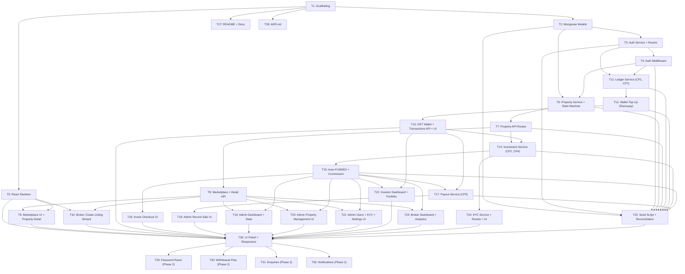

# Implementation Plan: ESTORA — Fractional Real Estate Investment Portal

## Overview

ESTORA is built as a MERN-stack monorepo (`client/` for React 18 + Vite, `server/` for Node.js + Express). The implementation follows a strict bottom-up order: scaffolding first, then data models, then auth, then the property lifecycle, then the money stack (ledger → wallet → investments → payouts), then dashboards, and finally polish and seed data. Every task delivers a runnable, testable increment. MVP (Phase 1) tasks are completed before any Phase 2 work begins. Property-based tests using **fast-check** (≥ 100 iterations each) are co-located with the task that implements the behaviour being tested, not deferred to a separate testing phase. All monetary values are stored and tested as **integer paise** throughout.

---

## Tasks

---

- [x] 1. Monorepo scaffolding — project structure, tooling, health check

**Goal:** Create the repository skeleton with correct folder structure, package.json files, ESLint/Prettier configs, and a single `GET /health` endpoint — no models or business logic.

**Requirement IDs:** R42, R43

**Files to create or modify:**
- `server/package.json` — dependencies: express, mongoose, jsonwebtoken, bcrypt, zod, helmet, cors, express-rate-limit, express-mongo-sanitize, morgan, multer, cloudinary, razorpay, nodemailer, dotenv; devDependencies: jest, supertest, fast-check, eslint, prettier, nodemon
- `client/package.json` — dependencies: react, react-dom, react-router-dom, axios, @tanstack/react-query, react-hook-form, zod, recharts, framer-motion, react-hot-toast, swiper, tailwindcss; devDependencies: vite, @vitejs/plugin-react, eslint, prettier, vitest
- `server/src/app.js` — Express app setup: cors, helmet, express.json, morgan; `GET /health` returns `{ status: "ok" }`; exports app (no listen)
- `server/server.js` — imports app, connects DB, calls `app.listen(PORT)`
- `server/src/config/env.js` — loads and validates env vars with Zod; throws on missing required vars
- `server/src/config/db.js` — Mongoose connect function; logs connection status
- `server/src/config/cloudinary.js` — configures Cloudinary SDK from env vars
- `server/src/config/razorpay.js` — creates and exports Razorpay instance from env vars
- `server/src/utils/ApiError.js` — custom error class with `statusCode`, `code`, `message`, `details`
- `server/src/utils/asyncHandler.js` — wraps async route handlers to forward errors to `next()`
- `server/src/utils/money.js` — `toPaise(rupees)`, `toRupees(paise)`, `floorDiv(a, b)` helpers
- `server/src/utils/pagination.js` — `getPagination(query)` and `paginate(Model, filter, options)` helpers
- `server/src/middlewares/errorHandler.js` — central Express error handler; formats `ApiError` and generic errors into `{ success, error: { code, message, details } }`; omits stack in production
- `server/.env.example` — all required server env vars with placeholder values and comments
- `client/src/App.jsx` — minimal React app shell
- `client/src/main.jsx` — ReactDOM.createRoot entry point
- `client/src/index.css` — Tailwind directives + CSS custom properties for design tokens
- `client/tailwind.config.js` — Tailwind config with design system colours (`#0F2A4A`, `#10B981`, `#D4A017`, etc.)
- `client/vite.config.js` — Vite config with React plugin
- `client/.env.example` — `VITE_API_URL` and `VITE_RAZORPAY_KEY_ID` with placeholder values
- `.gitignore` — node_modules, .env, dist, build, coverage

**Tests required:**
- [integration] `GET /health` returns HTTP 200 `{ status: "ok" }`
- [unit] `ApiError` constructor sets `statusCode`, `code`, `message`, `details`
- [unit] `money.js` — `toPaise(1)` === 100, `toRupees(100)` === 1, `floorDiv(10, 3)` === 3

**Done condition:** `npm install` succeeds in both `server/` and `client/`; `GET /health` returns 200; ESLint and Prettier configs are present; no `.env` file with real secrets exists.

---

- [x] 2. Mongoose models — all nine schemas with indexes

**Goal:** Define all nine Mongoose schemas with correct field types, enums, indexes, and the `walletBalance` + `idempotencyKey` fields as specified in the design.

**Requirement IDs:** R1, R7, R16, R19, R20, R28, R38, R39

**Files to create or modify:**
- `server/src/models/User.js` — fields: name, email (unique), phone, passwordHash (select:false), role (ADMIN|BROKER|INVESTOR), isActive (default:true), brokerApproved (default:false), walletBalance (Number, default:0), kyc `{ status, docs[], reason }`, resetPasswordToken (select:false), resetPasswordExpires (select:false); indexes: `{ email:1 }` unique, `{ role:1 }`
- `server/src/models/Property.js` — all fields from design including title, description, type enum, address, city, state, pincode, geo, areaSqft, images[], documents[], valuation, totalUnits, unitPrice, minUnits, maxUnitsPerInvestor, unitsSold (default:0), expectedAppreciationPct, rentalYieldPct, holdingPeriodMonths, status enum (DRAFT|PENDING_APPROVAL|LIVE|FUNDED|HOLDING|SOLD|REJECTED|CANCELLED), rejectionReason, brokerId (ref:User), approvedBy (ref:User), salePrice, liveAt, fundedAt, soldAt; indexes: `{ status:1, city:1 }`, `{ brokerId:1 }`
- `server/src/models/Investment.js` — investorId (ref:User), propertyId (ref:Property), units, amount, status (ACTIVE|EXITED|REFUNDED), payoutAmount, idempotencyKey (unique sparse); indexes: `{ investorId:1, propertyId:1 }` compound, `{ propertyId:1 }`, `{ idempotencyKey:1 }` unique sparse
- `server/src/models/Transaction.js` — userId (ref:User), type enum (TOPUP|INVESTMENT|PAYOUT|REFUND|COMMISSION|WITHDRAWAL|FEE), direction enum (CREDIT|DEBIT), amount (positive paise), balanceAfter, refType, refId, gatewayPaymentId (sparse); indexes: `{ userId:1, createdAt:-1 }`, `{ gatewayPaymentId:1 }` unique sparse
- `server/src/models/Payout.js` — propertyId (ref:Property, unique), salePrice, platformFee, distributable, items[] `{ investorId, units, ownershipPct, amount }`, executedBy (ref:User), executedAt; index: `{ propertyId:1 }` unique
- `server/src/models/Withdrawal.js` — userId (ref:User), amount, status (PENDING|APPROVED|REJECTED), bankDetails (Object), processedBy (ref:User); indexes: `{ userId:1, createdAt:-1 }`, `{ status:1, createdAt:1 }`
- `server/src/models/Enquiry.js` — propertyId (ref:Property), investorId (ref:User), brokerId (ref:User), messages[] `{ from, text, at }`, status (OPEN|CLOSED); indexes: `{ investorId:1 }`, `{ brokerId:1 }`
- `server/src/models/Notification.js` — userId (ref:User), type, title, body, link, read (default:false); index: `{ userId:1, read:1, createdAt:-1 }`
- `server/src/models/Settings.js` — platformFeePct (default:2), brokerCommissionPct (default:1), maxOwnershipPct (default:49); singleton enforced by `findOneAndUpdate({ }, data, { upsert:true })`

**Tests required:**
- [unit] `User` model — email uniqueness constraint rejects duplicate; `walletBalance` defaults to 0; `passwordHash` excluded from default query results
- [unit] `Investment` model — `idempotencyKey` sparse unique index rejects duplicate non-null key; second insert with same key throws duplicate key error
- [unit] `Property` model — `unitsSold` defaults to 0; status defaults to DRAFT; status enum rejects invalid value
- [unit] `Transaction` model — `gatewayPaymentId` unique sparse allows multiple null values but rejects duplicate non-null strings
- [unit] `Settings` model — upsert creates a singleton; second upsert updates without creating a second document

**Done condition:** All nine model files exist; `mongoose.model()` calls succeed against a test MongoDB; unique index tests pass; no TypeErrors on model import.

---

- [x] 3. Auth service + routes (register, login, logout, /auth/me)

**Goal:** Implement full user registration, login, JWT issuance, logout, and profile retrieval with server-side Zod validation.

**Requirement IDs:** R1, R2, R3, R4

**Files to create or modify:**
- `server/src/validators/auth.validator.js` — Zod schemas: `registerSchema` (name, email, phone, password ≥8 chars + ≥1 digit + ≥1 symbol, role INVESTOR|BROKER), `loginSchema` (email, password)
- `server/src/services/auth.service.js` — `register(data)`: rejects ADMIN role (400 INVALID_ROLE), checks email uniqueness (409 EMAIL_TAKEN), bcrypt.hash(password, BCRYPT_ROUNDS), creates User with isActive=true, brokerApproved=false for BROKER; `login(email, password)`: finds user, bcrypt.compare, checks isActive (401 ACCOUNT_DEACTIVATED), issues JWT `{ userId, role }` expiring in JWT_EXPIRES_IN; `me(userId)`: returns `{ _id, name, email, phone, role, isActive, kyc.status, brokerApproved }`
- `server/src/controllers/auth.controller.js` — thin controllers: extract body, call service, format response
- `server/src/routes/auth.routes.js` — POST /register, POST /login, POST /logout, GET /me (authenticated)
- `server/src/app.js` — mount auth routes at `/api/v1/auth`

**Tests required:**
- [integration] POST /auth/register with valid INVESTOR data → 201, user object returned, no password in response
- [integration] POST /auth/register with duplicate email → 409 EMAIL_TAKEN
- [integration] POST /auth/register with role=ADMIN → 400 INVALID_ROLE
- [integration] POST /auth/register with weak password (no digit) → 400 VALIDATION_ERROR
- [integration] POST /auth/login with correct credentials → 200, JWT token returned
- [integration] POST /auth/login with wrong password → 401 INVALID_CREDENTIALS
- [integration] POST /auth/login with nonexistent email → 401 INVALID_CREDENTIALS
- [integration] GET /auth/me with valid JWT → 200, user object (no passwordHash)
- [integration] GET /auth/me with no token → 401 UNAUTHORIZED

**Done condition:** All integration tests pass against a real test MongoDB instance (not mocked); JWT is verifiable with `jwt.verify()`; `passwordHash` never appears in any API response.

---

- [x] 4. Auth middleware stack (authenticate, requireRole, requireOwnership, validate, rateLimiter, upload)

**Goal:** Implement the full Express middleware pipeline used by every protected route.

**Requirement IDs:** R5, R20, R28, R40, R42, R43

**Files to create or modify:**
- `server/src/middlewares/authenticate.js` — extracts Bearer token, calls `jwt.verify()`, re-fetches `user.isActive` from DB on every request, attaches `req.user`; 401 UNAUTHORIZED for bad token, 401 ACCOUNT_DEACTIVATED for isActive=false
- `server/src/middlewares/requireRole.js` — checks `req.user.role` in allowed roles; for BROKER additionally checks `brokerApproved===true`; 403 FORBIDDEN or 403 BROKER_NOT_APPROVED
- `server/src/middlewares/requireOwnership.js` — fetches property by `req.params.id`, compares `property.brokerId.toString() === req.user._id.toString()`; 403 FORBIDDEN if mismatch; 404 NOT_FOUND if property absent
- `server/src/middlewares/validate.js` — `validate(schema)` factory: calls `schema.parse(req.body | req.query | req.params)`; on ZodError throws `ApiError(400, 'VALIDATION_ERROR', message, issues)`
- `server/src/middlewares/rateLimiter.js` — two instances: `authLimiter` (15 req/15 min), `investLimiter` (10 req/1 min); returns 429 on breach
- `server/src/middlewares/upload.js` — Multer memory storage; MIME whitelist: image/jpeg, image/png, image/webp, application/pdf; max 5 MB per file; rejects with 400 INVALID_FILE
- `server/src/app.js` — add `express-mongo-sanitize` and `morgan` to middleware stack

**Tests required:**
- [unit] `authenticate` — valid JWT passes through; expired JWT returns 401 UNAUTHORIZED; deactivated user with valid JWT returns 401 ACCOUNT_DEACTIVATED
- [unit] `requireRole` — correct role passes; wrong role returns 403 FORBIDDEN; BROKER with brokerApproved=false returns 403 BROKER_NOT_APPROVED
- [unit] `requireOwnership` — matching brokerId passes; non-owner returns 403 FORBIDDEN; nonexistent property returns 404
- [unit] `validate` — valid Zod schema passes; invalid body returns 400 VALIDATION_ERROR with field-level details
- [unit] `upload` — MIME type not in whitelist returns 400 INVALID_FILE; file over 5 MB rejected

**Done condition:** All middleware unit tests pass; protected routes return correct HTTP status codes for auth failures; `POST /auth/login` is rate-limited to 15 requests per 15 minutes per IP.

---

- [x] 5. React app skeleton (Vite, React Router v6, layouts, AuthContext, ProtectedRoute, RoleRoute)

**Goal:** Set up the full React routing skeleton with role-aware layouts, auth context, and placeholder pages for every route defined in the design.

**Requirement IDs:** R2, R3, R4, R5, R40

**Files to create or modify:**
- `client/src/context/AuthContext.jsx` — provides `user`, `token`, `role`, `login(token, user)`, `logout()` via React Context; stores token in localStorage; exposes `useAuth()` hook
- `client/src/api/axios.js` — Axios instance with `baseURL: VITE_API_URL + '/api/v1'`; request interceptor attaches `Authorization: Bearer <token>`; response interceptor clears auth and redirects to `/login` on 401
- `client/src/api/auth.api.js` — `register(data)`, `login(data)`, `logout()`, `getMe()`
- `client/src/routes/AppRouter.jsx` — full route tree from design: public routes under PublicLayout, investor/broker/admin routes under DashboardLayout guarded by ProtectedRoute + RoleRoute
- `client/src/routes/ProtectedRoute.jsx` — redirects to `/login` if no token in AuthContext
- `client/src/routes/RoleRoute.jsx` — redirects to `/forbidden` if `user.role` does not match required role
- `client/src/layouts/PublicLayout.jsx` — renders TopBar (unauthenticated state), Footer, `<Outlet />`
- `client/src/layouts/DashboardLayout.jsx` — renders Sidebar (role-aware), TopBar (authenticated state), `<Outlet />`
- `client/src/components/layout/Sidebar.jsx` — role-aware nav links: investor links, broker links, admin links; active state styling
- `client/src/components/layout/TopBar.jsx` — logo; if authenticated: wallet balance (investor only), notification bell, avatar with logout; if unauthenticated: Login + Sign Up buttons
- `client/src/components/layout/Footer.jsx` — disclaimer text: "This is an academic project. No real money or securities are involved."
- `client/src/pages/public/Login.jsx` — email + password form; on success calls `auth.api.login`, stores token, redirects to role dashboard
- `client/src/pages/public/Signup.jsx` — name, email, phone, password, role toggle (INVESTOR/BROKER); on success redirects to `/login`
- `client/src/pages/shared/NotFound404.jsx` — 404 page with back-to-home link
- `client/src/pages/shared/Forbidden403.jsx` — 403 page with back-to-home link
- `client/src/utils/constants.js` — role enums, status enums, status chip colours, route paths
- All remaining page files as empty placeholder components returning a `<div>` with the page name — investor: Dashboard, Portfolio, InvestCheckout, Wallet, KYC, Enquiries; broker: Dashboard, MyProperties, CreateProperty, PropertyAnalytics; admin: Dashboard, AllProperties, RecordSale, Users, KYCQueue, Withdrawals, Settings; shared: Profile, Notifications

**Tests required:**
- [unit] `AuthContext` — `login()` stores token in localStorage and updates context; `logout()` clears token and redirects to `/login`
- [unit] `ProtectedRoute` — renders children when token present; redirects to `/login` when no token
- [unit] `RoleRoute` — renders children for matching role; redirects to `/forbidden` for wrong role
- [unit] Login page — form submission calls `auth.api.login`; successful login stores token and redirects

**Done condition:** `npm run dev` starts without errors; navigating to `/login` renders the login form; logging in with a valid JWT redirects to the correct role dashboard; unauthenticated navigation to `/investor` redirects to `/login`; navigating to a wrong-role route redirects to `/forbidden`.

---

- [x] 6. Property service + status machine + Zod validators

**Goal:** Implement the property service with all CRUD operations, the eight-state machine, and server-side Zod validation.

**Requirement IDs:** R7, R8, R9, R10, R11, R12, R13, R27

**Files to create or modify:**
- `server/src/validators/property.validator.js` — Zod schemas: `createPropertySchema` (all required fields from R7 AC2), `updatePropertySchema` (partial), `rejectSchema` (non-empty reason), `statusSchema` (HOLDING or CANCELLED), `sellSchema` (salePrice positive integer)
- `server/src/services/property.service.js` — `create(data, userId, role)`: computes unitPrice, validates integer (400 UNIT_PRICE_NOT_INTEGER), sets brokerId, unitsSold=0, status=DRAFT; `update(id, data, userId, role)`: enforces edit rules by status (R12); `validateTransition(current, next)`: checks VALID_TRANSITIONS map, throws 409 INVALID_TRANSITION; `submit(id, userId)`: DRAFT|REJECTED → PENDING_APPROVAL, validates ≥3 images (400 INSUFFICIENT_IMAGES); `approve(id, adminId)`: PENDING_APPROVAL → LIVE, sets approvedBy, liveAt; `reject(id, reason)`: PENDING_APPROVAL → REJECTED, stores rejectionReason; `cancel(id, adminId, session)`: LIVE → CANCELLED in MongoDB transaction — refunds all ACTIVE investments via ledger.post(REFUND/CREDIT), sets unitsSold=0; `transitionToHolding(id)`: FUNDED → HOLDING, no financial side effects

**Tests required:**
- [unit] `create()` — valid data creates property with status=DRAFT, unitsSold=0; non-integer unitPrice throws 400 UNIT_PRICE_NOT_INTEGER
- [unit] `submit()` — fewer than 3 images throws 400 INSUFFICIENT_IMAGES; DRAFT → PENDING_APPROVAL succeeds
- [unit] `approve()` — sets liveAt; rejects non-PENDING_APPROVAL status with 409
- [unit] `reject()` — stores rejectionReason; empty reason throws 400 REJECTION_REASON_REQUIRED
- [unit] `update()` — LIVE property rejects changes to valuation when investments exist (403 IMMUTABLE_FIELD); allows description change on LIVE
- [PBT] **CP5 Status Machine Soundness** — `fast-check` enumerates all (currentStatus, targetStatus) pairs from the status enum; for each pair outside VALID_TRANSITIONS assert `validateTransition()` throws INVALID_TRANSITION; for each valid pair assert it does not throw; minimum 100 iterations over random invalid pairs
- [integration] Cancel property — creates property + investments, cancels, asserts all investments REFUNDED and unitsSold=0

**Done condition:** All unit and PBT tests pass; `validateTransition()` rejects every invalid status pair with 409; cancel runs inside a MongoDB session and rolls back on error.

---

- [x] 7. Property API routes (POST, PATCH, submit, approve, reject, status, /broker/properties, /properties/:id/investors)

**Goal:** Wire all property management endpoints to the property service with correct middleware chains per the role permission table.

**Requirement IDs:** R7, R8, R9, R10, R11, R12, R13, R27, R31, R35, R37

**Files to create or modify:**
- `server/src/controllers/property.controller.js` — thin controllers for: createProperty, updateProperty, submitProperty, approveProperty, rejectProperty, changePropertyStatus, getBrokerProperties, getPropertyInvestors; each extracts params/body, calls service, returns `{ success: true, data }` envelope
- `server/src/routes/property.routes.js` — routes with middleware chains:
  - `POST /` → authenticate + requireRole(BROKER,ADMIN) + validate(createPropertySchema) → createProperty
  - `PATCH /:id` → authenticate + requireRole(BROKER,ADMIN) + requireOwnership (BROKER only) + validate(updatePropertySchema) → updateProperty
  - `POST /:id/submit` → authenticate + requireRole(BROKER) + requireOwnership → submitProperty
  - `POST /:id/approve` → authenticate + requireRole(ADMIN) → approveProperty
  - `POST /:id/reject` → authenticate + requireRole(ADMIN) + validate(rejectSchema) → rejectProperty
  - `POST /:id/status` → authenticate + requireRole(ADMIN) + validate(statusSchema) → changePropertyStatus
  - `GET /broker/properties` → authenticate + requireRole(BROKER) → getBrokerProperties
  - `GET /:id/investors` → authenticate + requireRole(BROKER,ADMIN) + requireOwnership (BROKER only) → getPropertyInvestors
- `server/src/app.js` — mount property routes at `/api/v1/properties` and `/api/v1/broker`

**Tests required:**
- [integration] POST /properties — approved BROKER creates property → 201; unapproved BROKER → 403 BROKER_NOT_APPROVED; INVESTOR → 403 FORBIDDEN
- [integration] POST /properties/:id/submit — owner broker with ≥3 images → 200, status=PENDING_APPROVAL; non-owner broker → 403
- [integration] POST /properties/:id/approve — Admin approves PENDING_APPROVAL → 200, status=LIVE; non-admin → 403
- [integration] POST /properties/:id/reject — Admin with reason → 200, status=REJECTED; missing reason → 400
- [integration] POST /properties/:id/status CANCELLED — refunds all investors; second cancel → 409 ALREADY_CANCELLED
- [PBT] **CP6 Refund Completeness** — `fast-check` generates a LIVE property with 1–10 investors holding random unit counts; executes cancel; asserts count of REFUND entries equals count of pre-cancel ACTIVE investments; each REFUND amount equals corresponding INVESTMENT debit amount; each investor walletBalance restored to pre-investment value

**Done condition:** All integration tests pass; role and ownership enforcement confirmed; CP6 PBT passes 100 iterations; cancel endpoint runs atomically (partial failure rolls back).

---

- [x] 8. Marketplace + Property detail API (GET /properties, GET /properties/:id)

**Goal:** Implement the paginated marketplace endpoint with all filters and the property detail endpoint with computed fields.

**Requirement IDs:** R14, R15, R33

**Files to create or modify:**
- `server/src/services/property.service.js` — add `getMarketplace(query, isAuthenticated)`: paginated query supporting page, limit, sort, search (title/city regex), city, type, minPrice, maxPrice, status filter, fundingPctMin, fundingPctMax; defaults to `{ status: { $in: ['LIVE','FUNDED'] } }` for unauthenticated callers; computes `fundingPct` per item; returns `{ items, page, limit, total, totalPages }`; add `getDetail(id)`: returns all property fields + computed `fundingPct = (unitsSold/totalUnits)*100`, `investorCount` (distinct ACTIVE investor count), `unitPrice`
- `server/src/controllers/property.controller.js` — add `getMarketplace`, `getPropertyDetail` controllers
- `server/src/routes/property.routes.js` — add:
  - `GET /` → public (optional authenticate) → getMarketplace
  - `GET /:id` → public → getPropertyDetail

**Tests required:**
- [integration] GET /properties (unauthenticated) — returns only LIVE+FUNDED properties by default
- [integration] GET /properties?status=DRAFT (unauthenticated) — still returns only LIVE+FUNDED (default override)
- [integration] GET /properties?city=Mumbai — filters by city correctly
- [integration] GET /properties?search=sea — matches title and city case-insensitively
- [integration] GET /properties?page=2&limit=5 — returns correct pagination metadata
- [integration] GET /properties/:id — returns fundingPct, investorCount, unitPrice in response
- [integration] GET /properties/:nonexistentId — returns 404 NOT_FOUND

**Done condition:** All integration tests pass; unauthenticated requests only see LIVE+FUNDED properties; all query parameters work independently and in combination; `fundingPct` and `investorCount` computed correctly.

---

- [x] 9. Marketplace UI + Property detail page (public pages)

**Goal:** Build the public-facing Marketplace and Property Detail pages with filters, search, funding progress, and return calculator.

**Requirement IDs:** R14, R15, R40, R41

**Files to create or modify:**
- `client/src/api/properties.api.js` — `getProperties(params)`, `getPropertyById(id)`
- `client/src/hooks/useProperties.js` — TanStack Query hooks: `useProperties(params)`, `useProperty(id)`
- `client/src/utils/formatINR.js` — `formatINR(paise)` using `Intl.NumberFormat('en-IN')` and `formatINRCompact(paise)` for abbreviations (Cr/L)
- `client/src/utils/calc.js` — `projectedValue(amount, appreciationPct, years)`, `ownershipPct(units, totalUnits)`, `fundingPct(unitsSold, totalUnits)`
- `client/src/components/ui/Button.jsx` — primary, secondary, danger, ghost variants; loading state; disabled state
- `client/src/components/ui/Card.jsx` — surface container with standard padding and shadow
- `client/src/components/ui/StatusChip.jsx` — colour-coded pill using status→colour mapping from constants.js
- `client/src/components/ui/Spinner.jsx` — loading spinner component
- `client/src/components/ui/EmptyState.jsx` — illustration + message + optional action button
- `client/src/components/ui/Pagination.jsx` — previous/next + page number controls
- `client/src/components/charts/FundingProgressBar.jsx` — animated progress bar; shifts from blue to emerald at 100%
- `client/src/components/property/PropertyCard.jsx` — image, title, city, StatusChip, unitPrice (formatINR), fundingPct bar, expectedAppreciationPct; links to `/properties/:id`
- `client/src/components/property/FilterSidebar.jsx` — city, type, minPrice/maxPrice, fundingPctMin/Max filters with clear-all button
- `client/src/components/property/ReturnCalculator.jsx` — unit input, holding period selector, computes projectedValue and ROI
- `client/src/components/property/MetricsCard.jsx` — displays unitPrice, totalUnits, minUnits, rentalYieldPct, holdingPeriodMonths
- `client/src/components/property/PropertyGallery.jsx` — Swiper carousel for property images
- `client/src/pages/public/Marketplace.jsx` — FilterSidebar + search input + sort dropdown + PropertyCard grid + Pagination; loading skeleton while fetching; EmptyState when no results; error state with retry
- `client/src/pages/public/PropertyDetail.jsx` — PropertyGallery, MetricsCard, FundingProgressBar, investorCount, documents list, ReturnCalculator; Invest CTA (redirects unauthenticated to /login; hidden when status ≠ LIVE); StatusChip for current status
- `client/src/pages/public/Landing.jsx` — hero section, how-it-works steps, featured LIVE properties (3 PropertyCards), platform stats, FAQ accordion, CTA, Footer

**Tests required:**
- [unit] `formatINR(100)` === '₹1'; `formatINRCompact(10000000)` includes 'L'; `formatINRCompact(1000000000)` includes 'Cr'
- [unit] `projectedValue(10000000, 10, 2)` === `10000000 * (1.1 ** 2)` (rupee math, paise input)
- [unit] `FundingProgressBar` renders at correct width for given fundingPct values
- [unit] `PropertyCard` renders StatusChip with correct colour for each status
- [unit] `FilterSidebar` fires onFilter callback with updated params on filter change

**Done condition:** Marketplace page renders a grid of properties from the API; filters narrow the list; pagination works; PropertyDetail shows all required sections; unauthenticated Invest CTA click redirects to `/login`; loading, empty, and error states all render correctly.

---

- [x] 10. Broker multi-step create listing wizard

**Goal:** Build the five-step property creation wizard that saves a DRAFT on step 1 and PATCHes on subsequent steps.

**Requirement IDs:** R36, R7, R12

**Files to create or modify:**
- `client/src/api/properties.api.js` — add `createProperty(data)`, `updateProperty(id, data)`, `submitProperty(id)`, `getBrokerProperties(params)`
- `client/src/components/ui/Input.jsx` — text, number, textarea variants with label, error message, and helper text
- `client/src/components/ui/Modal.jsx` — accessible modal with backdrop, title, close button
- `client/src/pages/broker/CreateProperty.jsx` — five-step wizard with progress indicator:
  - Step 1 (Basics): title, description, type dropdown → POST /properties on advance (creates DRAFT, stores id)
  - Step 2 (Location): address, city, state, pincode, geo lat/lng → PATCH /properties/:id
  - Step 3 (Financials): valuation, totalUnits, minUnits, maxUnitsPerInvestor, expectedAppreciationPct, rentalYieldPct, holdingPeriodMonths; live preview of `unitPrice = valuation / totalUnits` with inline error if non-integer → PATCH /properties/:id
  - Step 4 (Media & Docs): image upload (Cloudinary via server), document upload → PATCH /properties/:id
  - Step 5 (Review & Submit): read-only summary of all fields, Submit button → POST /properties/:id/submit; shows error if <3 images
  - On browser return, restores wizard to last saved step from GET /broker/properties
  - Back navigation preserves data
- `client/src/pages/broker/MyProperties.jsx` — table of broker's properties with StatusChip, fundingPct, actions: Edit draft, View analytics, Submit

**Tests required:**
- [unit] Step 3 Financials — live unitPrice preview updates on valuation/totalUnits change; shows "Unit price must be a whole rupee" when valuation not divisible by totalUnits
- [unit] Step 5 Review — Submit button disabled when image count < 3; shows correct count
- [unit] Wizard state — navigating back to step 2 preserves step 3 data
- [unit] `MyProperties` table — renders StatusChip for each status correctly

**Done condition:** A broker can complete all five steps and submit a property for approval; PATCH is called on each step advance; the wizard restores state from a saved DRAFT on page revisit; non-integer unitPrice shows an inline error and blocks step advance.

---

- [x] 11. Ledger service — atomic walletBalance, getBalance, transaction history

**Goal:** Implement the single-entry-point ledger service that atomically maintains `walletBalance` on the User document for every money movement.

**Requirement IDs:** R19, R22

**Files to create or modify:**
- `server/src/services/ledger.service.js` — `post({ userId, type, direction, amount, refType, refId, gatewayPaymentId, session })`: for TOPUP checks `gatewayPaymentId` uniqueness (409 DUPLICATE_TOPUP); for DEBIT uses `User.findOneAndUpdate({ _id:userId, walletBalance:{ $gte:amount } }, { $inc:{ walletBalance:-amount } })` — throws 400 INSUFFICIENT_BALANCE if null; for CREDIT uses `{ $inc:{ walletBalance:+amount } }`; creates append-only Transaction document with `balanceAfter` snapshot; all operations within caller's Mongo session; `getBalance(userId, session)`: aggregates `sum(CREDIT) − sum(DEBIT)` from Transaction collection (used for reconciliation only, not for balance reads)
- `server/src/controllers/wallet.controller.js` — add `getTransactions` controller
- `server/src/routes/wallet.routes.js` — `GET /transactions` → authenticate → getTransactions (supports page, limit, type, startDate, endDate, userId for Admin)
- `server/src/app.js` — mount wallet routes at `/api/v1/wallet`; mount transactions at `/api/v1/transactions`

**Tests required:**
- [unit] `post(CREDIT)` — increments `walletBalance` by amount; creates Transaction with correct `balanceAfter`
- [unit] `post(DEBIT)` with sufficient balance — decrements `walletBalance`; creates Transaction
- [unit] `post(DEBIT)` with insufficient balance — throws 400 INSUFFICIENT_BALANCE; `walletBalance` unchanged
- [unit] `post(TOPUP)` with duplicate `gatewayPaymentId` — throws 409 DUPLICATE_TOPUP; no Transaction created
- [unit] `getBalance()` aggregate matches `user.walletBalance` counter after multiple operations
- [PBT] **CP1 Wallet Balance Invariant** — `fast-check` generates random users and sequences of 1–20 valid TOPUP/CREDIT and INVESTMENT/DEBIT calls (ensuring balance never goes negative); after every operation asserts `getBalance(userId)` aggregate === `user.walletBalance` counter; minimum 100 iterations
- [PBT] **CP7 Atomic Debit Guard** — `fast-check` generates random (balance B, debit amount D) pairs where D > 0 and B ≥ 0; for D > B asserts INSUFFICIENT_BALANCE thrown and walletBalance unchanged; for D ≤ B asserts success and walletBalance === B − D; minimum 100 iterations

**Done condition:** All unit tests and both PBTs pass; `post()` within a MongoDB session rolls back atomically on transaction abort; `walletBalance` counter and `getBalance()` aggregate are identical after every seed of operations.

---

- [x] 12. Wallet top-up (Razorpay order/verify + duplicate prevention)

**Goal:** Implement Razorpay test-mode wallet top-up with HMAC signature verification and idempotent duplicate payment prevention.

**Requirement IDs:** R20

**Files to create or modify:**
- `server/src/validators/wallet.validator.js` — Zod schemas: `topupOrderSchema` (amount positive integer), `topupVerifySchema` (razorpayOrderId, razorpayPaymentId, razorpaySignature strings), `withdrawSchema` (amount positive integer, bankDetails object)
- `server/src/services/wallet.service.js` — `createTopupOrder(userId, amount)`: creates Razorpay order, returns `{ orderId, amount, currency }`; `verifyTopup(userId, { orderId, paymentId, signature })`: constructs HMAC-SHA256 signature from `orderId|paymentId` using RAZORPAY_KEY_SECRET, compares with submitted signature (400 INVALID_PAYMENT_SIGNATURE on mismatch), calls `ledger.post(TOPUP/CREDIT, gatewayPaymentId=paymentId)`
- `server/src/controllers/wallet.controller.js` — add `createTopupOrder`, `verifyTopup` controllers
- `server/src/routes/wallet.routes.js` — `POST /wallet/topup/order` → authenticate + requireRole(INVESTOR) + validate(topupOrderSchema) → createTopupOrder; `POST /wallet/topup/verify` → authenticate + requireRole(INVESTOR) + validate(topupVerifySchema) → verifyTopup

**Tests required:**
- [integration] POST /wallet/topup/order — valid investor request → 200, orderId returned
- [integration] POST /wallet/topup/verify — valid signature → 200, walletBalance increased
- [integration] POST /wallet/topup/verify — invalid signature → 400 INVALID_PAYMENT_SIGNATURE; walletBalance unchanged
- [integration] POST /wallet/topup/verify — duplicate razorpayPaymentId → 409 DUPLICATE_TOPUP; walletBalance not double-credited
- [integration] POST /wallet/topup/order — non-investor (BROKER) → 403 FORBIDDEN

**Done condition:** All integration tests pass; HMAC verification works correctly; duplicate paymentId rejected at ledger level; KYC status does not block top-up (R20 AC6).

---

- [x] 13. GET /wallet + GET /transactions API + Wallet UI page

**Goal:** Expose wallet balance (from counter field) and transaction history API endpoints, then build the full Wallet UI page.

**Requirement IDs:** R21, R22

**Files to create or modify:**
- `server/src/services/wallet.service.js` — add `getWallet(userId)`: returns `{ walletBalance: user.walletBalance, recentTransactions }` where recentTransactions = 10 most recent sorted by createdAt desc
- `server/src/controllers/wallet.controller.js` — add `getWallet` controller
- `server/src/routes/wallet.routes.js` — `GET /wallet` → authenticate + requireRole(INVESTOR) → getWallet; `GET /transactions` → authenticate → getTransactions (admin gets all; others get own)
- `client/src/api/wallet.api.js` — `getWallet()`, `createTopupOrder(amount)`, `verifyTopup(data)`, `getTransactions(params)`
- `client/src/hooks/useWallet.js` — TanStack Query hooks: `useWallet()`, `useTransactions(params)`
- `client/src/components/ui/Table.jsx` — sortable, paginated table with sticky header, empty state, row hover
- `client/src/components/ui/Toast.jsx` — success/error toast wrapper around react-hot-toast
- `client/src/pages/investor/Wallet.jsx` — wallet balance (formatINRCompact), Add Money button (opens Razorpay checkout flow), transaction history table with type/date/amount/direction columns, filters by type and date range, pagination; loading skeleton while fetching; success toast after top-up

**Tests required:**
- [integration] GET /wallet — returns walletBalance from counter field (not recomputed aggregate); returns 10 most recent transactions
- [integration] GET /transactions — investor sees only own transactions; admin sees all when no userId filter; admin filters by userId
- [integration] GET /transactions?type=TOPUP — filters by transaction type
- [unit] Wallet page — renders wallet balance from API; Add Money button is present; transaction table shows correct columns

**Done condition:** GET /wallet returns `walletBalance` from the `user.walletBalance` counter field; GET /transactions supports all query params from design; Wallet UI renders balance and transaction history with loading and empty states.

---

- [x] 14. Investment service — invest() with all 7 guards + atomic oversell prevention + idempotency

**Goal:** Implement the investment engine with all guard conditions, atomic `findOneAndUpdate` oversell prevention, and idempotency key deduplication.

**Requirement IDs:** R16, R18

**Files to create or modify:**
- `server/src/validators/investment.validator.js` — Zod schema: `investSchema` (propertyId ObjectId string, units positive integer, idempotencyKey optional string)
- `server/src/services/investment.service.js` — `invest(userId, propertyId, units, idempotencyKey)`: (1) if idempotencyKey present, check for existing Investment with same key and same investorId — return existing (200) if found; (2) fetch property, validate status===LIVE (409 INVALID_TRANSITION); (3) fetch user, validate kyc.status===APPROVED (403 KYC_NOT_APPROVED); (4) validate isActive===true; (5) compute amount=units×unitPrice server-side; (6) validate units≥minUnits; (7) validate units≤remaining (totalUnits−unitsSold); (8) sum existingActiveUnits for investor on property, validate (existingActiveUnits+units)≤maxUnitsPerInvestor (400 MAX_UNITS_EXCEEDED); (9) open MongoDB transaction: atomic `findOneAndUpdate({ _id, status:'LIVE', unitsSold:{ $lte:totalUnits-units } }, { $inc:{ unitsSold:units } })` — 409 INSUFFICIENT_UNITS if null; create Investment document; call `ledger.post(INVESTMENT/DEBIT, session)`; commit; return `{ investment, property, walletBalance }`; `getMyInvestments(userId, query)`: paginated with computed `ownershipPct`, `fundingPct`, property title/city/status
- `server/src/controllers/investment.controller.js` — `invest`, `getMyInvestments` controllers
- `server/src/routes/investment.routes.js` — `POST /investments` → authenticate + requireRole(INVESTOR) + investLimiter + validate(investSchema) → invest; `GET /investments/me` → authenticate + requireRole(INVESTOR) → getMyInvestments
- `server/src/app.js` — mount investment routes at `/api/v1`

**Tests required:**
- [integration] POST /investments — valid request → 201, investment created, walletBalance debited
- [integration] POST /investments — KYC not approved → 403 KYC_NOT_APPROVED
- [integration] POST /investments — insufficient wallet balance → 400 INSUFFICIENT_BALANCE
- [integration] POST /investments — units exceed maxUnitsPerInvestor → 400 MAX_UNITS_EXCEEDED
- [integration] POST /investments — units exceed remaining → 409 INSUFFICIENT_UNITS
- [integration] POST /investments — property not LIVE → 409 INVALID_TRANSITION
- [PBT] **CP2 No Overselling** — `fast-check` generates property with N=10..100 units; generates 2–5 concurrent invest calls totalling > N units; fires all concurrently (Promise.all); asserts sum of all ACTIVE investment units ≤ N; asserts correct number of 409 responses; minimum 100 iterations
- [PBT] **CP4 Investment Idempotency** — `fast-check` generates valid invest scenario + random idempotencyKey string; calls invest twice with same key; asserts both responses return same investment._id; asserts exactly one Investment document with that key; asserts exactly one INVESTMENT/DEBIT transaction; asserts walletBalance unchanged after second call; minimum 100 iterations

**Done condition:** All integration tests pass; both PBTs pass 100 iterations; the atomic oversell guard prevents over-funding even under concurrent load; idempotency key deduplication works at database level (unique index).

---

- [x] 15. Auto-FUNDED transition + broker commission credit (within invest() transaction)

**Goal:** Extend the investment service to auto-transition a property to FUNDED and credit broker commission when unitsSold === totalUnits, all within the same MongoDB transaction.

**Requirement IDs:** R17, R33

**Files to create or modify:**
- `server/src/services/investment.service.js` — extend `invest()`: after atomic `findOneAndUpdate` succeeds, check if `updatedProperty.unitsSold === updatedProperty.totalUnits`; if yes, within the same session: (a) fetch Settings document for `brokerCommissionPct`; (b) compute `commission = Math.floor(brokerCommissionPct * valuation / 100)`; (c) call `ledger.post(COMMISSION/CREDIT, userId=brokerId, session)`; (d) update `property.status = FUNDED`, `property.fundedAt = now`

**Tests required:**
- [integration] Invest to fill last units — property auto-transitions to FUNDED; broker receives COMMISSION/CREDIT ledger entry of correct amount
- [integration] Commission amount computed from live Settings document (not hardcoded); update Settings to 3%, re-invest, assert commission uses new rate
- [integration] Auto-FUNDED and commission credit are in the same transaction — simulate failure after FUNDED transition, assert no COMMISSION entry and property status rolled back
- [unit] Commission formula: `Math.floor(brokerCommissionPct * valuation / 100)` — verify with edge cases (1% of ₹1,00,000 paise = 1000 paise)

**Done condition:** Property transitions to FUNDED exactly when unitsSold reaches totalUnits; broker commission uses the live Settings rate; the entire invest + commission credit is atomic.

---

- [x] 16. Invest Checkout UI (unit selector, live calc, wallet balance check, confirm modal)

**Goal:** Build the Invest Checkout page with unit selector, real-time ownership and amount calculation, wallet balance validation, and confirm modal.

**Requirement IDs:** R16, R15, R41

**Files to create or modify:**
- `client/src/api/investments.api.js` — `invest(data)`, `getMyInvestments(params)`
- `client/src/components/ui/KPICard.jsx` — displays a metric label + formatted value with optional trend indicator
- `client/src/pages/investor/InvestCheckout.jsx` — fetches property detail; unit slider + number input (min=minUnits, max=remaining); live calculation panel: amount (formatINR), ownership % (2 decimal places), projected value (ReturnCalculator); wallet balance display with shortfall message if balance < amount; terms checkbox; Confirm button disabled when: wallet < amount OR units < minUnits OR unchecked terms; Confirm button opens ConfirmModal showing summary; on confirm calls `invest()` with generated idempotencyKey (crypto.randomUUID); success screen with portfolio link; error toast on failure

**Tests required:**
- [unit] Unit slider — updates amount and ownership % in real time
- [unit] Confirm button — disabled when walletBalance < computedAmount; shows shortfall amount
- [unit] Confirm button — disabled when units < minUnits
- [unit] ConfirmModal — shows correct amount, ownership %, and property title before confirm
- [unit] Success screen — renders after successful invest API call

**Done condition:** A KYC-approved investor with sufficient wallet balance can complete an investment through the UI; the Confirm button is disabled when balance is insufficient; the idempotency key is sent on every invest request; success screen links to portfolio.

---

- [x] 17. Payout service — previewPayout() + executePayout() with idempotency + assertion

**Goal:** Implement the payout service with pure preview computation and idempotent execute-payout within a MongoDB transaction, including the distributable sum assertion.

**Requirement IDs:** R25, R26

**Files to create or modify:**
- `server/src/validators/property.validator.js` — add `sellSchema` (salePrice positive integer paise)
- `server/src/services/payout.service.js` — `previewPayout(propertyId, salePrice)`: no DB writes; fetches property + all ACTIVE investments grouped by investor; computes `platformFee=Math.floor(salePrice*feePct/100)`, `distributable=salePrice-platformFee`; per-investor `floor(distributable*investorUnits/totalUnits)`; assigns remainder (`distributable - sum(items)`) to largest-unit investor (tie-break: earliest `Investment.createdAt`); returns `{ salePrice, platformFee, distributable, items: [{ investorId, investorName, units, ownershipPct, payoutAmount }], check: sum===distributable }`; `executePayout(propertyId, salePrice, adminId)`: (1) idempotency check — throw 409 ALREADY_SOLD if Payout doc exists; (2) validate `property.status===HOLDING` (409 INVALID_TRANSITION); (3) open MongoDB transaction: compute distribution (same logic), assert `sum(items) === distributable` (500 PAYOUT_ASSERTION_FAILED if fails), post one `PAYOUT/CREDIT` per investor, post one `FEE/CREDIT` for platform (userId=adminId), update each Investment to `EXITED+payoutAmount`, update property to `SOLD+salePrice+soldAt`, create Payout document; commit
- `server/src/controllers/property.controller.js` — add `getPayoutPreview`, `executePayout` controllers
- `server/src/routes/property.routes.js` — `GET /:id/payout-preview` → authenticate + requireRole(ADMIN) → getPayoutPreview; `POST /:id/sell` → authenticate + requireRole(ADMIN) + validate(sellSchema) → executePayout

**Tests required:**
- [unit] `previewPayout()` — single investor gets 100% of distributable; remainder goes to largest holder; `check` field is true
- [unit] `previewPayout()` — uneven division: assert `sum(items) === distributable` exactly; remainder assigned to correct investor
- [unit] `executePayout()` — duplicate execution (Payout doc exists) → 409 ALREADY_SOLD; no additional ledger entries
- [unit] `executePayout()` — property not in HOLDING → 409 INVALID_TRANSITION
- [integration] POST /properties/:id/sell — HOLDING property → 200, all investors receive PAYOUT/CREDIT, property.status=SOLD, Payout doc created
- [integration] POST /properties/:id/sell called twice → second call returns 409 ALREADY_SOLD
- [PBT] **CP3 Payout Completeness** — `fast-check` generates: salePrice (100–10,000,000 paise), platformFeePct (0–10), investor unit arrays (1–20 investors, units 1–1000, array sum ≤ 10000); calls `computePayouts()`; asserts `sum(items) === distributable` for every generated input; minimum 100 iterations including edge cases (single investor, many investors, zero fee, large numbers)

**Done condition:** All unit tests pass; CP3 PBT passes 100+ iterations; `executePayout()` is atomic — if ledger.post fails for any investor the whole transaction rolls back; second execute call returns 409 immediately.

---

- [x] 18. Admin Record Sale UI + payout preview table + confirm execute

**Goal:** Build the Admin Record Sale page with sale price input, payout preview table, and the final confirm-and-execute flow.

**Requirement IDs:** R25, R26, R31

**Files to create or modify:**
- `client/src/api/properties.api.js` — add `getPayoutPreview(id, salePrice)`, `executeSale(id, salePrice)`
- `client/src/pages/admin/RecordSale.jsx` — sale price input (paise, displays in rupees); Preview button calls GET /payout-preview and renders table of `{ investorName, units, ownershipPct, payoutAmount }`; table footer shows platformFee, distributable, check boolean; Confirm & Execute button opens ConfirmModal with totals; on confirm calls POST /properties/:id/sell; success redirects to admin properties list; error toast on failure; loading state during preview and execute

**Tests required:**
- [unit] RecordSale page — Preview button disabled when salePrice is empty or zero
- [unit] Payout preview table — renders all investor rows with correct formatINR amounts
- [unit] ConfirmModal — shows platformFee and distributable in rupees
- [unit] After successful execute — success message rendered and redirects

**Done condition:** Admin can preview payout distribution before committing; the confirm step calls the execute endpoint exactly once; the page handles loading, error, and success states correctly.

---

- [x] 19. Admin dashboard — GET /admin/stats KPIs + charts + approval queues

**Goal:** Implement the admin stats API endpoint and build the Admin Dashboard page with KPI cards, charts, and pending approval queue counts.

**Requirement IDs:** R30, R31

**Files to create or modify:**
- `server/src/services/` — create `admin.service.js`: `getStats()`: aggregates `totalAUM` (sum of valuation for LIVE+FUNDED+HOLDING properties), `usersByRole` (group by role), `livePropertiesCount`, `fundsRaisedThisMonth` (sum of INVESTMENT DEBIT amounts in current calendar month), `platformFeesEarned` (sum of FEE CREDIT amounts in ledger); also returns pending queue counts: `pendingProperties` (PENDING_APPROVAL count), `pendingKYC` (users with kyc.status=PENDING count), `pendingBrokers` (BROKER users with brokerApproved=false count)
- `server/src/controllers/admin.controller.js` — `getStats` controller
- `server/src/routes/admin.routes.js` — `GET /admin/stats` → authenticate + requireRole(ADMIN) → getStats
- `server/src/app.js` — mount admin routes at `/api/v1/admin`
- `client/src/api/admin.api.js` — `getAdminStats()`, `getAdminUsers(params)`, `updateUser(id, data)`, `getAdminWithdrawals(params)`, `updateWithdrawal(id, data)`, `getSettings()`, `updateSettings(data)`, `reviewKYC(userId, data)`
- `client/src/components/charts/PropertiesByStatus.jsx` — Recharts BarChart showing property count by status
- `client/src/components/charts/FundsRaisedLine.jsx` — Recharts LineChart showing monthly investment totals
- `client/src/pages/admin/Dashboard.jsx` — 5 KPICards (totalAUM, livePropertiesCount, fundsRaisedThisMonth, platformFeesEarned, user count), PropertiesByStatus chart, FundsRaisedLine chart, 3 pending queue count cards with links to approval pages; loading skeleton while fetching

**Tests required:**
- [integration] GET /admin/stats — returns all required fields; non-admin → 403
- [integration] totalAUM includes only LIVE+FUNDED+HOLDING properties; excludes DRAFT, SOLD, CANCELLED
- [integration] fundsRaisedThisMonth only counts INVESTMENT type DEBIT transactions in current month
- [unit] Admin Dashboard — renders 5 KPI cards; renders PropertiesByStatus chart; pending queue cards link to correct admin pages

**Done condition:** GET /admin/stats returns all documented fields; admin dashboard renders with KPI cards and both charts; pending approval counts are accurate.

---

- [x] 20. Admin property management UI (all properties table, approve/reject modal, status controls)

**Goal:** Build the Admin Properties page with full management capabilities including the approve/reject modal and status transition controls.

**Requirement IDs:** R10, R11, R13, R27, R31

**Files to create or modify:**
- `server/src/services/admin.service.js` — add `getAllProperties(query)`: returns all properties regardless of status, supporting status/brokerId/city filters with pagination
- `server/src/routes/admin.routes.js` — `GET /admin/properties` → authenticate + requireRole(ADMIN) → getAllProperties
- `client/src/pages/admin/AllProperties.jsx` — paginated table of all properties with columns: title, type, city, status (StatusChip), brokerId name, fundingPct, actions; filter bar: status dropdown, city input; approve button → inline modal (confirmation only); reject button → modal with mandatory reason text area; FUNDED→HOLDING button; LIVE→CANCELLED button (with confirmation modal warning about investor refunds); each row links to property detail; HOLDING properties link to RecordSale page

**Tests required:**
- [unit] AllProperties table — renders StatusChip for each status; approve/reject buttons visible only for PENDING_APPROVAL rows
- [unit] Reject modal — Confirm button disabled when reason input is empty
- [unit] Cancel modal — shows warning text about investor refunds
- [unit] FUNDED→HOLDING button — visible only for FUNDED status rows

**Done condition:** Admin can approve, reject (with reason), move to HOLDING, and cancel (with refund warning) properties from the table; all modals require explicit confirmation; status changes reflected immediately via TanStack Query invalidation.

---

- [x] 21. Admin user management + KYC queue + Settings UI

**Goal:** Build the Admin Users page, KYC Queue page, and Settings page.

**Requirement IDs:** R29, R32, R33, R34

**Files to create or modify:**
- `server/src/services/admin.service.js` — add `getUsers(query)`: all users with search (name/email), role filter, pagination; `updateUser(id, data)`: sets isActive or brokerApproved; prevents self-deactivation (403 FORBIDDEN)
- `server/src/services/kyc.service.js` — `adminReview(targetUserId, status, reason)`: sets kyc.status, validates reason on rejection; calls `notification.service.create()` for investor
- `server/src/controllers/admin.controller.js` — add `getUsers`, `updateUser`, `reviewKYC`, `getSettings`, `updateSettings` controllers
- `server/src/routes/admin.routes.js` — `GET /admin/users`, `PATCH /admin/users/:id`, `PATCH /admin/kyc/:userId`, `GET /admin/settings`, `PATCH /admin/settings`
- `client/src/pages/admin/Users.jsx` — search input, role filter tabs, paginated user table with columns: name, email, role, isActive toggle, brokerApproved toggle (BROKER only), KYC status badge; isActive toggle calls PATCH /admin/users/:id; brokerApproved toggle calls PATCH /admin/users/:id; deactivating own account shows error toast
- `client/src/pages/admin/KYCQueue.jsx` — table of users with kyc.status=PENDING; each row shows name, email, document preview links (open Cloudinary URL in new tab); Approve button; Reject button (opens modal requiring reason)
- `client/src/pages/admin/Settings.jsx` — form with platformFeePct, brokerCommissionPct, maxOwnershipPct inputs; current values loaded from GET /admin/settings; Save button calls PATCH /admin/settings; success toast on save

**Tests required:**
- [integration] PATCH /admin/users/:id — deactivate user → subsequent login returns 401 ACCOUNT_DEACTIVATED
- [integration] PATCH /admin/users/:id — approve broker → broker can now create properties
- [integration] Admin cannot deactivate own account → 403 FORBIDDEN
- [integration] PATCH /admin/kyc/:userId APPROVED → user.kyc.status=APPROVED; investor can now invest
- [integration] PATCH /admin/kyc/:userId REJECTED with empty reason → 400 REJECTION_REASON_REQUIRED
- [integration] GET/PATCH /admin/settings — returns singleton; update persists; Investment and Payout services use updated values
- [unit] Users page — isActive toggle fires correct API call; shows error when admin tries to deactivate self

**Done condition:** Admin can deactivate users, approve brokers, and approve/reject KYC; settings changes persist and are used by subsequent transactions; all pages have loading and error states.

---

- [x] 22. Investor dashboard + Portfolio page

**Goal:** Implement the portfolio summary API endpoint and build the Investor Dashboard and Portfolio pages with the allocation donut chart and holdings table.

**Requirement IDs:** R24

**Files to create or modify:**
- `server/src/services/portfolio.service.js` — `getSummary(userId)`: aggregates ACTIVE investments: `totalInvested` (sum of amount for ACTIVE), `currentEstValue` (sum of `amount × (1 + appreciationPct/100)^(holdingPeriodMonths/12)` per property), `totalPayouts` (sum of payoutAmount for EXITED), `overallROI` (`((totalPayouts - exitedInvested) / exitedInvested) × 100` where denominator is EXITED positions only), `allocations` array: per property `{ propertyId, title, units, ownershipPct, investedAmount, estimatedValue, status, payoutReceived }`
- `server/src/controllers/portfolio.controller.js` — `getSummary` controller
- `server/src/routes/portfolio.routes.js` — `GET /portfolio/summary` → authenticate + requireRole(INVESTOR) → getSummary
- `server/src/app.js` — mount portfolio routes at `/api/v1`
- `client/src/api/portfolio.api.js` — `getPortfolioSummary()`
- `client/src/hooks/usePortfolio.js` — `usePortfolioSummary()` TanStack Query hook
- `client/src/components/charts/AllocationDonut.jsx` — Recharts PieChart rendering allocations array; each slice labelled by property title + ownership %; tooltip shows investedAmount
- `client/src/pages/investor/Dashboard.jsx` — 5 KPICards: totalInvested, currentEstValue, totalPayouts, overallROI (red if negative), walletBalance; AllocationDonut chart; recent transactions list (last 5); recommended properties grid (3 LIVE PropertyCards)
- `client/src/pages/investor/Portfolio.jsx` — holdings table columns: property title, StatusChip, units, ownership%, invested amount, estimated value, payout received, ROI per position; row click → `/properties/:id`; empty state when no investments; loading skeleton

**Tests required:**
- [integration] GET /portfolio/summary — returns all required fields; totalInvested matches sum of ACTIVE investment amounts; overallROI = 0 when no EXITED investments
- [integration] Portfolio after payout — EXITED investment shows payoutReceived; overallROI computed correctly with paise integers
- [unit] `AllocationDonut` — renders one PieChart slice per allocation item
- [unit] Investor Dashboard — overallROI displayed in red when negative; wallet balance formatted with formatINRCompact

**Done condition:** GET /portfolio/summary returns all documented fields; AllocationDonut renders; Portfolio table shows all holdings with correct computed values; negative ROI is displayed in danger colour.

---

- [x] 23. Broker dashboard + property analytics

**Goal:** Build the Broker Dashboard with KPI cards and commission earned, and the Property Analytics page with funding timeline and investor table.

**Requirement IDs:** R35, R37

**Files to create or modify:**
- `server/src/services/property.service.js` — add stats computation to `getBrokerProperties()`: per property include `fundingPct`, `investorCount` (distinct ACTIVE investors); add `getPropertyInvestors(id)`: returns `[{ investorId, name, units, ownershipPct, investedAmount, status }]`
- `server/src/services/admin.service.js` — add broker commission query: `getCommissionEarned(brokerId)`: sum of COMMISSION/CREDIT transactions for broker userId
- `client/src/components/property/InvestorTable.jsx` — table of investors: name, units, ownership%, invested amount, status
- `client/src/pages/broker/Dashboard.jsx` — 5 KPICards: total properties listed, properties live, properties funded, total raised (sum of unitsSold×unitPrice across own properties), commission earned (COMMISSION transaction sum); FundingProgressBar per property; link to properties list; pending broker approval banner if brokerApproved=false
- `client/src/pages/broker/PropertyAnalytics.jsx` — property header with StatusChip; FundingProgressBar; InvestorTable (fetched from GET /properties/:id/investors); enquiries list placeholder (Phase 2)

**Tests required:**
- [integration] GET /broker/properties — returns only own properties; each includes fundingPct and investorCount
- [integration] GET /properties/:id/investors — owner broker gets investor list; non-owner broker → 403
- [unit] Broker Dashboard — commission earned KPI card renders; unapproved broker banner shown when brokerApproved=false
- [unit] PropertyAnalytics — InvestorTable renders ownership % for each investor

**Done condition:** Broker dashboard shows accurate KPIs for own properties only; PropertyAnalytics shows investor list with correct ownership percentages; non-owner broker cannot access another broker's investor list.

---

- [x] 24. KYC service + routes + KYC UI page

**Goal:** Implement KYC document upload (Cloudinary), admin review API, and the Investor KYC page.

**Requirement IDs:** R28, R29

**Files to create or modify:**
- `server/src/services/kyc.service.js` — `submit(userId, files)`: validates max 2 files, MIME whitelist, 5MB limit (400 INVALID_FILE); uploads to Cloudinary via SDK; updates `user.kyc = { status:PENDING, docs:[urls] }`; rejects if already APPROVED (409 KYC_ALREADY_APPROVED); `adminReview(targetUserId, status, reason)`: APPROVED clears reason; REJECTED stores reason; validates non-empty reason on rejection (400 REJECTION_REASON_REQUIRED); calls `notification.service.create()` (no-op until Task 32)
- `server/src/controllers/kyc.controller.js` — `submitKYC`, `reviewKYC` controllers
- `server/src/routes/kyc.routes.js` — `POST /kyc` → authenticate + requireRole(INVESTOR) + upload.array('docs', 2) → submitKYC; `PATCH /admin/kyc/:userId` → authenticate + requireRole(ADMIN) + validate(adminKycSchema) → reviewKYC
- `server/src/app.js` — mount KYC routes at `/api/v1`
- `client/src/api/` — add KYC calls to `admin.api.js`: `getKYCQueue()`, `reviewKYC(userId, data)`
- `client/src/pages/investor/KYC.jsx` — KYC status banner (NOT_SUBMITTED/PENDING/APPROVED/REJECTED with reason); file upload form (accepts image/jpeg, image/png, image/webp, application/pdf; max 2 files, 5MB each); upload button; status badge using StatusChip; rejection reason displayed when REJECTED; already-approved message when APPROVED
- `client/src/pages/admin/KYCQueue.jsx` — (complete implementation from Task 21 stub)

**Tests required:**
- [integration] POST /kyc — uploads 2 valid files → 200, user.kyc.status=PENDING
- [integration] POST /kyc — 3rd file rejected (max 2) → 400
- [integration] POST /kyc — PDF > 5MB → 400 INVALID_FILE
- [integration] POST /kyc — already APPROVED → 409 KYC_ALREADY_APPROVED
- [integration] POST /investments — investor with kyc.status=PENDING → 403 KYC_NOT_APPROVED
- [unit] KYC page — APPROVED status shows success message; REJECTED shows reason; NOT_SUBMITTED shows upload form

**Done condition:** Investor can upload KYC documents; admin can approve/reject; approved investor can invest; non-approved investor receives 403 on invest attempt; KYC is not required for wallet top-up.

---

- [x] 25. Seed script — 8 properties, 5 investors, 2 brokers, 1 admin + reconciliation assertion

**Goal:** Create a comprehensive seed script with realistic data covering all property statuses and wallet ledger entries, ending with the R19 AC6 reconciliation assertion.

**Requirement IDs:** R19, R44

**Files to create or modify:**
- `server/scripts/seed.js` — seed data:
  - 1 admin user (admin@estora.dev / Admin@123)
  - 2 broker users: broker1@estora.dev / Broker@123 (brokerApproved=true), broker2@estora.dev / Broker@123 (brokerApproved=false)
  - 5 investor users: investor1–4 (kyc.status=APPROVED, wallets pre-loaded), investor5 (kyc.status=PENDING)
  - 8 properties spanning all statuses: 2 LIVE (partly funded at ~40% and ~75%), 1 FUNDED, 1 HOLDING, 1 SOLD, 1 PENDING_APPROVAL, 1 REJECTED, 1 DRAFT
  - Realistic ledger entries for every funded/holding/sold property: TOPUP, INVESTMENT, COMMISSION, PAYOUT, FEE transactions with correct balanceAfter snapshots and integer paise amounts
  - For SOLD property: Payout document with correct items array; all related investments in EXITED status
  - Final reconciliation loop: for every user with transactions, assert `user.walletBalance === getBalance(userId)` — process.exit(1) with descriptive error if mismatch
  - Clears all collections before seeding (idempotent)
- `package.json` (server) — add `"seed": "node scripts/seed.js"` script

**Tests required:**
- [integration] `node scripts/seed.js` exits with code 0
- [integration] After seed: exactly 8 properties exist; status distribution matches specification
- [integration] After seed: reconciliation assertion passes — `user.walletBalance === sum(CREDIT) − sum(DEBIT)` for every seeded user
- [integration] After seed: SOLD property has a Payout document; all its investments are EXITED
- [integration] Seed script is idempotent — running twice produces the same data set (no duplicates)

**Done condition:** `npm run seed` exits 0; reconciliation assertion passes for all seeded users; README test credentials match seeded accounts; all 8 property status variants exist.

---

- [x] 26. UI polish — loading skeletons, empty states, error states, toasts, responsive pass

**Goal:** Complete all UI quality requirements: loading states, empty states, error states, success toasts, and responsive layout from 360px.

**Requirement IDs:** R40, R41

**Files to create or modify:**
- `client/src/components/ui/Spinner.jsx` — update with skeleton variant for lists and cards
- `client/src/components/ui/EmptyState.jsx` — add icon variants for properties, investments, transactions, notifications
- Every page component that makes API calls — add:
  - Loading: skeleton cards/rows using Tailwind `animate-pulse` while `isLoading === true`
  - Empty: `EmptyState` component when data array is empty
  - Error: error message + "Try again" button when `isError === true`; TanStack Query `refetch()` on retry click
  - Success: `react-hot-toast` success toast after: successful investment, successful top-up, property submitted, KYC uploaded, settings saved
- `client/src/index.css` — verify all Tailwind responsive breakpoints present: `sm:` (640px), `md:` (768px), `lg:` (1024px); no horizontal scroll at 360px
- `client/src/components/layout/Sidebar.jsx` — collapsible on mobile (hamburger toggle); overlay on mobile

**Tests required:**
- [unit] Marketplace page — renders skeleton cards when `isLoading=true`; renders EmptyState when `items=[]`; renders error message when `isError=true`
- [unit] Wallet page — renders spinner during top-up verify; renders success toast message after successful top-up
- [unit] Sidebar — renders hamburger on viewport < 640px; clicking hamburger toggles sidebar visibility
- [unit] All money-action success flows — toast renders with correct message

**Done condition:** Every data-driven page has all three states (loading, empty, error); every mutating action shows a success or error toast; no horizontal scroll at 360px viewport; sidebar collapses on mobile.

---

- [x] 27. README.md + AGENTS.md + .env.example files + ESLint/Prettier config

**Goal:** Write complete setup documentation, finalize the AGENTS.md for AI context, and ensure ESLint/Prettier configs pass.

**Requirement IDs:** R42, R43, R44

**Files to create or modify:**
- `README.md` — setup steps: prerequisites (Node 18+, MongoDB Atlas, Cloudinary, Razorpay test keys), clone → install → env setup → seed → run; test credentials table (admin, broker, investor); live deployment URLs placeholder; features overview
- `AGENTS.md` — project structure overview for AI coding agents; key architectural decisions; money rules (always paise integers); service layer boundaries; middleware chain order
- `server/.env.example` — all server env vars with comments (from design.md Deployment section)
- `client/.env.example` — all client env vars with comments
- `.eslintrc.js` (server) — ESLint config with Node.js rules, no-console rule (warn), consistent-return
- `.prettierrc` (server) — single quotes, 2-space indent, trailing commas ES5
- `.eslintrc.js` (client) — ESLint config with React rules, react-hooks plugin
- `.prettierrc` (client) — same as server

**Tests required:**
- [unit] `eslint --max-warnings 0 server/src` exits 0 with no lint errors
- [unit] `eslint --max-warnings 0 client/src` exits 0 with no lint errors

**Done condition:** Both ESLint configs pass with zero warnings; README contains working setup instructions and test credentials; `.env.example` files list every required variable.

---

- [x] 28. ADR.md — Architecture Decision Records

**Goal:** Document the key technical decisions made during design so future developers understand the rationale.

**Requirement IDs:** R43

**Files to create or modify:**
- `ADR.md` — architecture decision records covering:
  - ADR-001: All money stored as integer paise (never floating point)
  - ADR-002: Append-only ledger as financial source of truth; `walletBalance` is a derived counter kept in sync atomically
  - ADR-003: MongoDB multi-document transactions for investment atomicity (requires replica set)
  - ADR-004: No server-side session or refresh token (JWT access token only, 1-day expiry, out of scope per R3 AC3)
  - ADR-005: TanStack Query for all server state on the frontend (no Redux)
  - ADR-006: Zod for validation both server-side (API layer) and client-side (forms) — schemas mirror each other
  - ADR-007: `findOneAndUpdate` atomic guard for oversell prevention (not optimistic locking or distributed locks)
  - ADR-008: Payout remainder assigned to largest unit holder (earliest `createdAt` tie-break) to ensure exact distributable sum

**Tests required:** None (documentation task)

**Done condition:** `ADR.md` exists with all eight ADRs; each ADR includes Context, Decision, and Consequences sections.

---

## Phase 2 Tasks

---

- [x] 29. Password reset via email (POST /auth/forgot-password, POST /auth/reset-password/:token)

**Goal:** Implement time-limited email-based password reset using Nodemailer or Resend.

**Requirement IDs:** R6

**Files to create or modify:**
- `server/src/services/auth.service.js` — add `forgotPassword(email)`: generates crypto.randomBytes(32) reset token, hashes it, stores `resetPasswordToken` + `resetPasswordExpires = now+1h` on user; sends email via Nodemailer/Resend with reset link; always returns 200 regardless of email existence (no user enumeration); add `resetPassword(token, newPassword)`: hashes incoming token, finds user by hash with unexpired expiry (400 INVALID_OR_EXPIRED_TOKEN if not found), updates passwordHash, clears resetPasswordToken/Expires
- `server/src/validators/auth.validator.js` — add `forgotPasswordSchema` (email), `resetPasswordSchema` (password with policy)
- `server/src/routes/auth.routes.js` — `POST /auth/forgot-password` public, `POST /auth/reset-password/:token` public
- `client/src/pages/public/ForgotPassword.jsx` — email input form; success message shown regardless of email existence
- `client/src/pages/public/ResetPassword.jsx` — new password + confirm password inputs; redirects to login on success

**Tests required:**
- [integration] POST /auth/forgot-password — registered email → 200 generic message; token stored on user
- [integration] POST /auth/forgot-password — unregistered email → 200 same generic message (no user enumeration)
- [integration] POST /auth/reset-password/:token — valid token → 200, password updated, token cleared
- [integration] POST /auth/reset-password/:token — expired token → 400 INVALID_OR_EXPIRED_TOKEN
- [integration] POST /auth/reset-password/:token — already-used token → 400 INVALID_OR_EXPIRED_TOKEN

**Done condition:** Password reset flow works end-to-end; token is time-limited to 1 hour; email is sent (or logged in test mode); no user enumeration on forgot-password.

---

- [x] 30. Withdrawal flow (POST /wallet/withdraw, admin queue, PATCH /admin/withdrawals/:id)

**Goal:** Implement investor withdrawal requests and the admin approval/rejection queue.

**Requirement IDs:** R23, R34

**Files to create or modify:**
- `server/src/services/wallet.service.js` — add `createWithdrawal(userId, amount, bankDetails)`: validates amount>0 and amount≤walletBalance (400 INVALID_WITHDRAWAL_AMOUNT); creates Withdrawal with status=PENDING (does NOT debit wallet yet); add `processWithdrawal(withdrawalId, adminId, status)`: APPROVED → `ledger.post(WITHDRAWAL/DEBIT)`; REJECTED → update status, no ledger entry
- `server/src/controllers/wallet.controller.js` — add `createWithdrawal` controller
- `server/src/routes/wallet.routes.js` — `POST /wallet/withdraw` → authenticate + requireRole(INVESTOR) + validate(withdrawSchema) → createWithdrawal
- `server/src/routes/admin.routes.js` — `GET /admin/withdrawals`, `PATCH /admin/withdrawals/:id`
- `client/src/pages/investor/Wallet.jsx` — add Withdraw button (opens modal with amount input + dummy bank details); pending withdrawal badge showing current PENDING request
- `client/src/pages/admin/Withdrawals.jsx` — table of PENDING withdrawals sorted oldest first; Approve and Reject buttons per row

**Tests required:**
- [integration] POST /wallet/withdraw — amount ≤ walletBalance → 201, Withdrawal created with PENDING status; walletBalance NOT yet debited
- [integration] POST /wallet/withdraw — amount > walletBalance → 400 INVALID_WITHDRAWAL_AMOUNT
- [integration] PATCH /admin/withdrawals/:id APPROVED → walletBalance debited; Withdrawal status=APPROVED; DEBIT ledger entry created
- [integration] PATCH /admin/withdrawals/:id REJECTED → walletBalance unchanged; Withdrawal status=REJECTED; no ledger entry

**Done condition:** Withdrawal request creates PENDING status without debiting wallet; admin approval debits via ledger; admin rejection leaves balance unchanged.

---

- [x] 31. Enquiries (POST /enquiries, GET /enquiries, POST /enquiries/:id/reply, Enquiries UI)

**Goal:** Implement the property enquiry system with bidirectional investor–broker messaging.

**Requirement IDs:** R39

**Files to create or modify:**
- `server/src/services/` — create `enquiry.service.js`: `create(investorId, propertyId, message)`: fetches property to get brokerId, creates Enquiry with initial message; `list(userId, role)`: investor sees own enquiries; broker sees enquiries on own properties; `reply(enquiryId, userId, role, text)`: validates caller is enquiry's investor or property's broker (403 FORBIDDEN if neither); appends `{ from: userId, text, at: now }` to messages array
- `server/src/controllers/enquiry.controller.js` — `createEnquiry`, `getEnquiries`, `replyToEnquiry` controllers
- `server/src/routes/enquiry.routes.js` — `POST /enquiries`, `GET /enquiries`, `POST /enquiries/:id/reply`
- `client/src/api/enquiries.api.js` — `createEnquiry(data)`, `getEnquiries()`, `replyToEnquiry(id, text)`
- `client/src/pages/investor/Enquiries.jsx` — list of investor's enquiries with property name, last message preview, status chip; click to expand thread; reply input field
- `client/src/pages/broker/PropertyAnalytics.jsx` — add enquiries thread list below InvestorTable

**Tests required:**
- [integration] POST /enquiries — creates Enquiry with initial message and status=OPEN
- [integration] GET /enquiries — investor sees only own enquiries; broker sees only enquiries on own properties
- [integration] POST /enquiries/:id/reply — investor can reply to own enquiry; broker can reply to enquiry on own property; unrelated user → 403 FORBIDDEN
- [unit] Enquiries page — renders thread messages; reply input fires correct API call

**Done condition:** Investors can create enquiries; brokers and investors can reply in thread; neither party can access the other's unrelated enquiries; 403 returned for unauthorized reply attempts.

---

- [x] 32. In-app notifications (service, GET /notifications, PATCH /notifications/:id/read, unread badge)

**Goal:** Implement the notification service and connect it to all eight trigger events, plus the notification UI with unread badge.

**Requirement IDs:** R38

**Files to create or modify:**
- `server/src/services/notification.service.js` — `create({ userId, type, title, body, link })`: inserts Notification document; `list(userId, query)`: paginated, sorted by createdAt desc, includes `unreadCount`; `markRead(notificationId, userId)`: sets read=true, validates ownership
- Connect notification.service.create() calls in:
  - `property.service.js` approve() → notify broker (PROPERTY_APPROVED)
  - `property.service.js` reject() → notify broker (PROPERTY_REJECTED with reason in body)
  - `investment.service.js` auto-FUNDED → notify broker + all active investors (PROPERTY_FUNDED)
  - `payout.service.js` executePayout() → notify each investor (PAYOUT_CREDITED with amount)
  - `kyc.service.js` adminReview() APPROVED → notify investor (KYC_APPROVED)
  - `kyc.service.js` adminReview() REJECTED → notify investor (KYC_REJECTED with reason)
- `server/src/controllers/notification.controller.js` — `getNotifications`, `markNotificationRead`
- `server/src/routes/notification.routes.js` — `GET /notifications`, `PATCH /notifications/:id/read`
- `client/src/api/notifications.api.js` — `getNotifications(params)`, `markNotificationRead(id)`
- `client/src/hooks/useNotifications.js` — `useNotifications()` TanStack Query hook with polling every 30s
- `client/src/components/layout/TopBar.jsx` — add notification bell with unreadCount badge; clicking opens notification dropdown/panel
- `client/src/pages/shared/Notifications.jsx` — full notification list with read/unread styling; mark-as-read on click; mark-all-read button

**Tests required:**
- [integration] Property approved → broker notification created with type PROPERTY_APPROVED
- [integration] KYC approved → investor notification created with type KYC_APPROVED
- [integration] Payout executed → one notification per investor with type PAYOUT_CREDITED
- [integration] GET /notifications — returns own notifications only; unreadCount matches unread documents
- [integration] PATCH /notifications/:id/read — sets read=true; other user's notification → 403
- [unit] TopBar — renders unread badge when unreadCount > 0; badge hidden when unreadCount === 0

**Done condition:** All eight notification trigger events create the correct notification documents; GET /notifications returns paginated results with unreadCount; TopBar badge reflects unread count; marking read updates the badge.

---

## Notes

- Tasks marked with `*` suffix on sub-tasks are optional and can be skipped for a faster MVP
- All monetary values in tests and implementation use **integer paise** only — never floating point
- Property-based tests use **fast-check** with **minimum 100 iterations** each
- Checkpoints: after T5, T13, T18, T25, T26 — run all tests and ensure the app starts without errors before continuing
- Each task references specific requirements for full traceability back to requirements.md
- Phase 2 tasks (T29–T32) require the full MVP to be working first

---

## Task Dependency Graph


```json
{
  "waves": [
    {"wave": 1, "tasks": ["1"]},
    {"wave": 2, "tasks": ["2", "5"]},
    {"wave": 3, "tasks": ["3", "4"]},
    {"wave": 4, "tasks": ["6"]},
    {"wave": 5, "tasks": ["7", "11"]},
    {"wave": 6, "tasks": ["8", "9", "12"]},
    {"wave": 7, "tasks": ["10", "13"]},
    {"wave": 8, "tasks": ["14"]},
    {"wave": 9, "tasks": ["15"]},
    {"wave": 10, "tasks": ["16", "17"]},
    {"wave": 11, "tasks": ["18", "19", "20", "21", "22", "23", "24"]},
    {"wave": 12, "tasks": ["25"]},
    {"wave": 13, "tasks": ["26", "27", "28"]},
    {"wave": 14, "tasks": ["29", "30", "31", "32"]}
  ]
}
```


## Completion and remaining submission items

Tasks 1–32 are implemented, including all four Phase 2 features. This status was checked against the project source and `IMPLEMENTATION.md`; the financial and state properties have 100 generated cases each, and the implementation report records 26 backend and 39 frontend tests. The items below are release and submission work, not unimplemented application features.

### Remaining before submission

- [ ] Deploy the frontend and API and record their live URLs. If hosting is unavailable, prepare and verify the documented local demo as the submission fallback; a live deployment has not been performed.
- [ ] Record a 3–5 minute narrated demo covering the P0 flows. Include two investors attempting to buy the last available units; automated concurrency tests exist, but this recording has not been made.
- [ ] Submit the repository, README, environment examples, test credentials, Postman collection, and either deployment URLs or local-run instructions through the instructor’s required channel before the deadline.

The PRD and original brief contain older or optional requests that conflict with the final `docs/requirements.md`. Follow the final requirements as `AGENTS.md` directs. Features explicitly out of scope there—including refresh-token rotation, secondary trading, rental distributions, audit logs, email event notifications, dark mode, broker withdrawals, and admin investing—are not remaining tasks.
